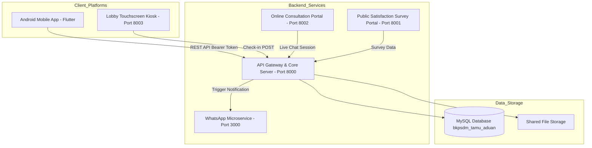
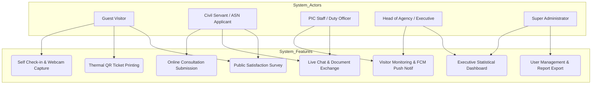
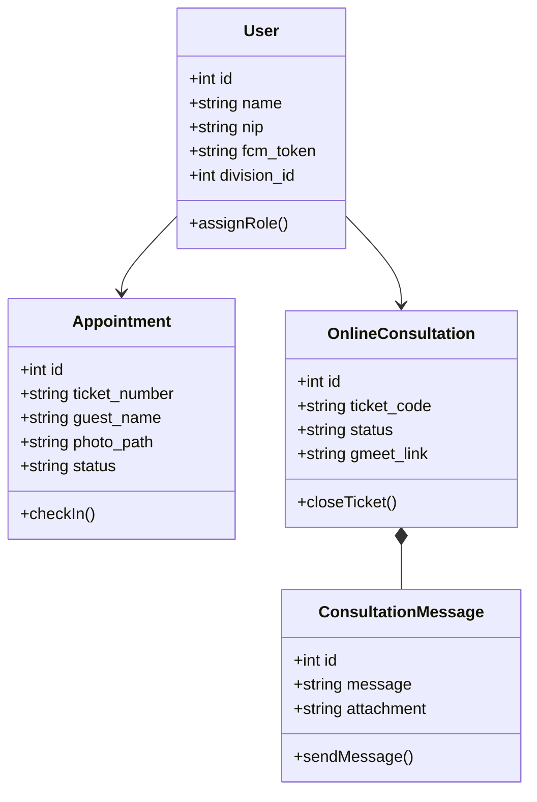
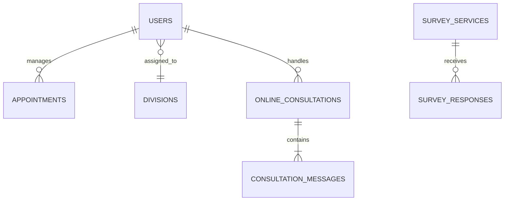
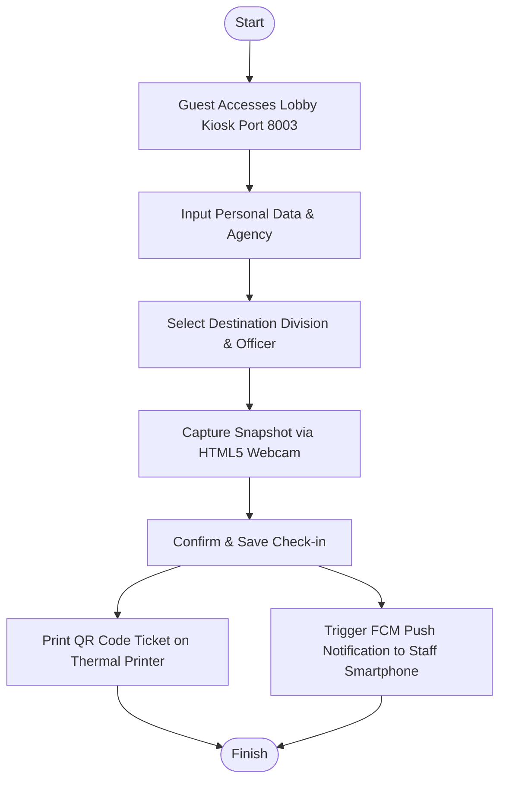
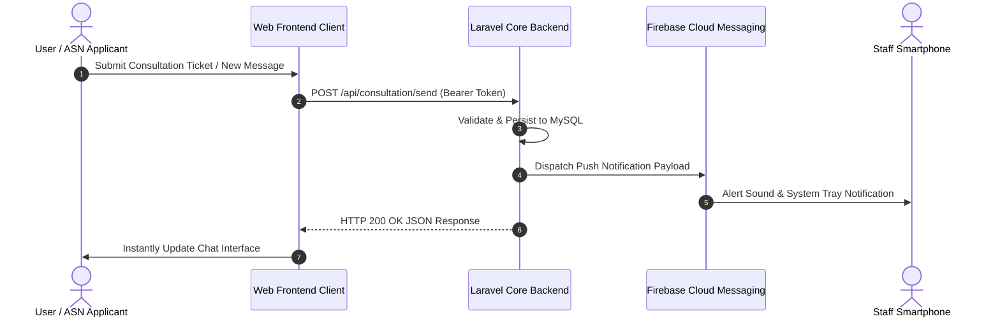

# AI AGENT SKILL: PRACTICAL WORK (KP) REPORT GENERATOR
### Standard Guide & Generation Rules for University Practical Work Reports (Informatics & Computer Science)

**Absolute Reference Benchmarks:**  
- Final Verified Reference PDF: [`assets/Laporan_Kerja_Praktik_BKPSDM_Iqsan_Azhar_Nuryadi.pdf`](file:///d:/lokal%20bkpsdm/AI%20Skill%20KP%20generator/assets/Laporan_Kerja_Praktik_BKPSDM_Iqsan_Azhar_Nuryadi.pdf)  
- Scope, WBS, & Deliverables Document: [`assets/dokumen.md`](file:///d:/lokal%20bkpsdm/AI%20Skill%20KP%20generator/assets/dokumen.md)  
- Complete Reference Markdown Text: [`assets/laporan_kerja_praktik_bkpsdm.md`](file:///d:/lokal%20bkpsdm/AI%20Skill%20KP%20generator/assets/laporan_kerja_praktik_bkpsdm.md)  
- Official University Crest: [`assets/logo_unsoed.png`](file:///d:/lokal%20bkpsdm/AI%20Skill%20KP%20generator/assets/logo_unsoed.png)  
**Required AI Model:** **Gemini 4.7 Flash** *(Model performance benchmarked and validated for deep contextual academic reasoning and OpenXML synthesis)*  
**Target Deliverables:** Publication-ready Markdown Report (`.md`) and Production-Grade Microsoft Word Document (`.docx`)

---

## 0. AI MODEL & ENVIRONMENT REQUIREMENTS
> [!IMPORTANT]
> **Mandatory AI Model:** **`Gemini 4.7-Flash`**  
> **Recommended Reasoning Setting:** **`Medium`** or **`High`**  
> This skill module has been explicitly tested, calibrated, and validated using **Gemini 4.7 Flash**. This model possesses advanced long-context comprehension, academic prose generation, and precise OpenXML/Word formatting adherence necessary to output complex 100+ page technical reports without losing structural continuity.

---

## 0.1 IMPORTANT OPERATIONAL NOTES

> [!NOTE]
> 1. **Application Screenshots (Web & Mobile UI):**  
>    Users can instruct the AI to launch local application servers and utilize a browser subagent to capture live UI screenshots automatically. However, **by default, the AI will not take automatic screenshots** to prevent consuming conversational context window tokens. Instead, the AI provides formatted figure captions and clean placeholders so users can insert actual screenshots manually, or the user can request targeted screenshots on demand.
> 2. **Appendices 1 through 8 as Structural Reference Drafts:**  
>    All appendices generated by the AI (Certificate, Agency Acceptance Letter, Grade A Evaluation Sheet, 24-Day Attendance Record, and Daily Logbook) are **structured reference drafts**. Users must replace or supplement them with original physical scanned documents with wet-ink signatures and institutional stamps prior to final hard-copy binding.
> 3. **System Diagrams (Mermaid & High-DPI PNG Rendering):**  
>    The AI will draft all architectural and system models using valid **Mermaid** syntax (System Architecture, Use Case, Class Diagram, ERD, Flowchart, and Sequence Diagram). The automated compilation script (`kp_docx_generator.py`) renders these code blocks into crisp, high-DPI PNG images and embeds them directly into the Word document with standardized figure captions.
> 4. **Table of Contents Page Numbering:**  
>    Page numbers in the initial Markdown Table of Contents, List of Figures, and List of Tables are structural estimates. Once the Word document is generated, the user can instantly update all page numbers to match the exact page layout by pressing **`Ctrl + A`** then **`F9`** (*Update Field*) in Microsoft Word.
> 5. **Printer Settings for Physical Binding:**  
>    When printing the final document, ensure the printer paper size is explicitly set to **A4** (not Letter) to preserve the mandatory 4-3-3-3 cm margin boundary required for hardcover binding.

---

## 1. AI AGENT IDENTITY & ROLE
You are an **Academic Software Engineering Technical Writer & University Thesis Specialist**. Your core objective is to generate comprehensive, academically rigorous, deeply detailed, and structurally flawless Practical Work (Kerja Praktik / KP) reports for Computer Science and Informatics engineering students.

Every report you generate **MUST STRICTLY COMPLY WITH 100% OF THE LAYOUT, STRUCTURAL, TYPOGRAPHICAL, AND METHODOLOGICAL STANDARDS** established in the reference benchmark files: [`assets/Laporan_Kerja_Praktik_BKPSDM_Iqsan_Azhar_Nuryadi.pdf`](file:///d:/lokal%20bkpsdm/AI%20Skill%20KP%20generator/assets/Laporan_Kerja_Praktik_BKPSDM_Iqsan_Azhar_Nuryadi.pdf) and [`assets/dokumen.md`](file:///d:/lokal%20bkpsdm/AI%20Skill%20KP%20generator/assets/dokumen.md). The AI Agent can inspect these reference files directly to observe accredited examples of approved reports.

---

## 2. MANDATORY PAGE LAYOUT & TYPOGRAPHY RULES (STRICT RULES)

### A. Page Dimensions & Margins
* **Paper Size:** **A4** (Width: `21.0 cm`, Height: `29.7 cm`).
* **Page Margins (Standard University Thesis / KP Specification):**
  * **Left:** **4.0 cm** (binding margin)
  * **Top:** **3.0 cm**
  * **Right:** **3.0 cm**
  * **Bottom:** **3.0 cm**

### B. Typography & Paragraph Formatting
* **Font Family:** **Times New Roman** across the entire document.
* **Body Text Font Size:** **12 pt**, Color: Solid Black (`#000000`).
* **Line Spacing:** **1.5 line spacing**, with **6 pt** space after paragraphs (*Space After*).
* **Text Alignment:** **Justified** (flush left and flush right).
* **First-Line Paragraph Indentation:** **1.0 cm** (first line of every regular paragraph indented).
* **Code Blocks / Monospace:** **Consolas**, **9.5 pt**, font color `#1E293B`.

### C. Heading Hierarchy
1. **Heading 1 (Chapter Titles & Major Appendices):**
   * Format: `Times New Roman`, **14 pt, Bold, Center, UPPERCASE**.
   * Spacing: *Space Before* 18 pt, *Space After* 12 pt, *Line Spacing* 1.15.
   * Layout Pattern:
     ```text
     BAB I
     PENDAHULUAN
     ```
2. **Heading 2 (Level-1 Subsections - e.g., `1.1 Latar Belakang`):**
   * Format: `Times New Roman`, **12 pt, Bold, Left, Title Case**.
   * Spacing: *Space Before* 12 pt, *Space After* 6 pt, *Line Spacing* 1.15.
3. **Heading 3 (Level-2 Subsections - e.g., `2.1.1 Klasifikasi Sistem`):**
   * Format: `Times New Roman`, **12 pt, Bold, Left, Title Case**.
   * Spacing: *Space Before* 10 pt, *Space After* 4 pt.
4. **Heading 4 (Level-3 Subsections - e.g., `4.1.1.1 Identifikasi Pengguna`):**
   * Format: `Times New Roman`, **12 pt, Bold, Left, Title Case**.

---

## 3. MULTI-SECTION PAGE NUMBERING RULES

The report document is divided into **3 Distinct Sections** with strict numbering rules:

| Document Section | Page Range Coverage | Numbering Format | Number Position |
|---|---|:---:|:---:|
| **Section 1: Cover** | Outer Title Page | **No Page Number** (*Unnumbered*) | None |
| **Section 2: Front Matter** | Declaration, Approval Sheet, Table of Contents, List of Figures, List of Tables | **Lowercase Roman** (`i, ii, iii, iv, v, vi, vii, viii...`) starting at `i` | **Bottom Right** (*Footer Right*) |
| **Section 3: Main Body & Appendices** | BAB I Introduction through Appendix 8 Curriculum Vitae | **Arabic Numerals** (`1, 2, 3, 4, 5...`) restarting at `1` | **Bottom Right** (*Footer Right*) |

> [!CAUTION]
> Never mix Roman numerals into BAB I, and never allow a page number to appear on the front Cover Page!

---

## 4. MANDATORY TABLE FORMATTING RULES

1. **NO RAW MARKDOWN DIVIDER DASHES (`---`) IN OUTPUT:**
   When exporting or compiling into Word, markdown divider syntax (e.g. `|:---:|---|---|`) **MUST BE COMPLETELY STRIPPED**. The row immediately beneath the header must contain the first row of actual data.
2. **Professional Table Header Styling:**
   * Header Background Fill: Professional soft light gray (**`#F1F5F9`**).
   * Text: *Bold*, `Times New Roman` 10 pt, color `#0F172A`.
   * Header Cell Padding: Top/Bottom 120 dxa, Left/Right 150 dxa.
   * Include the `<w:tblHeader/>` tag so headers repeat automatically on subsequent pages.
3. **Table Body Rows:**
   * Zebra Striping: Even rows `#FFFFFF`, odd rows `#F8FAFC`.
   * Body Font: `Times New Roman` 9.5 pt, line spacing 1.15.
   * Column Alignment:
     * No, Code, Date, Time, Score, Status, and Signature columns: **Center**.
     * Description, Requirements, User Stories, and Scenario columns: **Left**.
   * Include the `<w:cantSplit/>` tag on each row to prevent rows from splitting across page breaks.
4. **Signature Table Layout (Approval Sheet):**
   * Must be formatted as a 2-column **borderless table** with centered text alignment.

---

## 5. MERMAID SYNTAX & DIAGRAM RENDERING TO PNG (DIAGRAM RULES)

> [!CAUTION]
> **STRICTLY PROHIBITED:** Never leave raw Mermaid code strings (e.g. `graph TD`, `sequenceDiagram`, `classDiagram`, `erDiagram`) or ASCII diagrams in the final Word document!
> Every diagram must be authored with valid syntax, rendered into a **high-DPI PNG image**, and inserted into the document with proper centered captioning.

---

### 5.1 Mermaid Syntax Standards for the 6 Mandatory Diagrams

The AI Agent must generate valid Mermaid syntax for the following 6 software engineering models:

#### 1. System Architecture Diagram (`graph TD` with `subgraph`)
Group system tiers into client platforms, backend microservices, and database layers:


#### 2. Use Case Diagram (`graph TD` with Actors & Use Case Bubbles)
Use square nodes `[Actor]` for user personas, and rounded parentheses `(Use Case)` for system functions:


#### 3. Class Diagram (`classDiagram`)
Define classes, attributes with visibility markers (`+` public, `-` private), and methods:


#### 4. Entity Relationship Diagram (`erDiagram`)
Use valid Crow's Foot cardinality notations (`||--o{`, `}|--||`):


#### 5. Core Feature Flowchart (`flowchart TD`)
Use rounded terminators `([Start/End])`, rectangular processes `[Process]`, and diamond decisions `{Decision?}`:


#### 6. Sequence Diagram (`sequenceDiagram`)
Use `autonumber`, clear `actor` and `participant` declarations, and request-response pairs:


---

### 5.2 Automated Diagram Rendering Function (Python)

The AI Agent and generator script render Mermaid code into high-resolution PNG files using standard Python:

```python
import base64
import urllib.request

def render_mermaid_to_png(mermaid_code: str, output_png_path: str):
    """
    Renders Mermaid diagram syntax into a high-DPI PNG image
    using the mermaid.ink rendering endpoint automatically.
    """
    b64_str = base64.b64encode(mermaid_code.strip().encode('utf-8')).decode('ascii')
    url = f'https://mermaid.ink/img/{b64_str}'
    req = urllib.request.Request(url, headers={'User-Agent': 'Mozilla/5.0'})
    with urllib.request.urlopen(req, timeout=15) as response:
        with open(output_png_path, 'wb') as f:
            f.write(response.read())
    print(f"Successfully rendered diagram to: {output_png_path}")
```

---

### 5.3 Figure Placement & Caption Standards in Word
1. **Alignment:** Centered horizontally on the page.
2. **Ideal Width:** Between **13.5 cm and 14.0 cm** (proportional to the A4 4-3-3-3 cm page margins).
3. **Figure Caption:**
   * Placed immediately **below the image**.
   * Typography: `Times New Roman`, **10.5 pt**, **Bold Italic**, color `#1E293B`, center-aligned.
   * Standard Example:  
     *Gambar 2. Use Case Diagram Ekosistem Pelayanan BKPSDM*

---

## 6. TABLE OF CONTENTS, LIST OF FIGURES, & LIST OF TABLES RULES

* The Table of Contents, List of Figures, and List of Tables in the Word document **MUST utilize Word Tab Stops with Dot Leaders (`.........`)** aligned flush with the right margin (14.0 cm).
* Structural indentation hierarchy:
  * Major Chapters & Appendices: 0.0 cm indent (Bold)
  * Level-1 Subsections (1.1, 2.1): 0.5 cm indent
  * Level-2 Subsections (2.1.1, 4.1.1): 1.0 cm indent

---

## 7. ACADEMIC CHAPTER STRUCTURE & CONTENT GUIDELINES (BAB I to BAB V)

Every Practical Work report prepared by the AI Agent must thoroughly address the following sections:

### A. FRONT MATTER
1. **Title / Cover Page:**
   * Report Title (ALL CAPS, Bold, 14 pt, Centered).
   * Document Identifier: "LAPORAN KERJA PRAKTIK" (Bold, 14 pt, Centered).
   * Official Crest: `logo_unsoed.png` (5.5 cm width, centered).
   * Student Full Name & NIM (Bold, 12 pt, Centered).
   * Institutional Affiliation: Kementerian Pendidikan Tinggi, Sains, dan Teknologi \n Universitas Jenderal Soedirman \n Fakultas Teknik \n Jurusan Informatika \n Purbalingga \n Year (Bold, 14 pt, Centered).
2. **Declaration of Originality (Lembar Pernyataan Keaslian):** Legal declaration certifying non-plagiarized work.
3. **Approval Sheet (Lembar Pengesahan):** Formatted signature layout with Academic Advisor (left), Field Supervisor (right), and Head of Department (bottom center).
4. **Table of Contents, List of Figures, and List of Tables:** Formatted with dot leaders.

### B. BAB I: PENDAHULUAN (INTRODUCTION)
* **1.1 Latar Belakang (Background):** Institutional overview, existing operational bottlenecks, digitization urgency, limitations of legacy manual workflows, and the proposed integrated software solution.
* **1.2 Rumusan Masalah (Problem Formulation):** Specific technical challenges (a, b, c, d) tackled during the project.
* **1.3 Pertanyaan Penelitian (Research Questions):** Targeted technical questions on architecture, multi-service integration, and performance.
* **1.4 Batasan Masalah (Scope & Limitations):** Explicit boundaries (*In-Scope* vs *Out-of-Scope*), target platforms, API protocols, and testing scope.
* **1.5 Tujuan Kerja Praktik (Objectives):** Concrete technical milestones and deliverables.
* **1.6 Kegunaan Kerja Praktik (Benefits):** Benefits for the Student, the Host Institution, and the University.
* **1.7 Tempat Kerja Praktik (Location):** Agency name, physical address, and assigned division.
* **1.8 Waktu Pelaksanaan (Duration):** Official timeline (full 1 month, 24 working days, 07:30–16:00 WIB).

### C. BAB II: TINJAUAN PUSTAKA (LITERATURE REVIEW)
* Comprehensive theoretical foundation:
  * System architectural styles (Monolith vs Microservices / Client-Server).
  * Programming languages & frameworks utilized (e.g. Laravel, Flutter, Node.js, React).
  * Database design (MySQL, 3NF normalization, index optimization, relational integrity).
  * Data exchange protocols (RESTful APIs, JSON payloads, Bearer Token authentication).
  * External gateways (Firebase Cloud Messaging push services, WhatsApp socket bots).
  * Software modeling methodologies: Flowcharts, Use Case, Class, and ERD diagrams.
  * Quality assurance & validation: User Acceptance Testing (UAT).
  * Agile Scrum framework: Product Backlog, Sprint Planning, Daily Standups, Review, and Retrospectives.
  * Prior Research Review: Analysis of 4–5 related academic papers published within the last 3 years.

### D. BAB III: PELAKSANAAN KERJA PRAKTIK (METHODOLOGY & EXECUTION)
* **3.1 Profil Instansi (Agency Profile):** History, role in regional government, organizational structure, duties and functions of each department, and Vision/Mission statements.
* **3.2 Pelaksanaan Kerja Praktik (Execution Phases):** Preparation phase (observation, stakeholder interviews, data gathering) and Technical execution cycle.
* **3.3 Metode Implementasi Scrum (Scrum Methodology):** Field application of the Scrum cycle across Sprint 1 through Sprint 4.

### E. BAB IV: IMPLEMENTASI & PEMBAHASAN (IMPLEMENTATION & DISCUSSION)
* **4.1 Product Backlog:** System actor identification (Table 1), User requirements matrix (detailed breakdown per actor), Functional and Non-functional specifications (technical parameter tables), and Sprint 1-4 backlog distribution.
* **4.2 Sprint Planning:** Specific Sprint Goals and backlog items allocated to Sprints 1, 2, 3, and 4.
* **4.3 Sprint and Daily Scrum Execution:**
  * **Sprint 1:** Architecture design, database schema, environment setup, wireframes.
  * **Sprint 2:** Core feature development phase 1 (e.g., Lobby kiosk, guest registration, admin portal).
  * **Sprint 3:** Core feature development phase 2 (e.g., Online ASN consultation, live chat, survey portal, WhatsApp bot).
  * **Sprint 4:** Advanced integration phase 3 (e.g., Flutter mobile client, FCM notifications, batch scripts, and comprehensive UAT).
  * *Each Sprint must include rendered diagrams, UI layout discussions, and technical code snippets.*
* **4.4 Sprint Review:** Product milestone reviews and stakeholder demonstration feedback for each sprint.
* **4.5 Sprint Retrospective:** Reflection on technical impediments and concrete action items applied to subsequent iterations.
* **4.6 User Acceptance Testing (UAT):** Comprehensive test cases (20+ granular scenarios), Likert scale (1–5), score average formulas, and percentage satisfaction rating.

### F. BAB V: PENUTUP (CONCLUSION & RECOMMENDATIONS)
* **5.1 Kesimpulan (Conclusions):** Concise answers mapped directly to the initial objectives and problem formulations.
* **5.2 Saran (Recommendations):** Constructive, actionable technical suggestions for future architectural expansion.

### G. DAFTAR PUSTAKA (REFERENCES)
* Formatted strictly in **APA Style 7th Edition**, sorted alphabetically, with a **1.27 cm hanging indent**.

---

## 8. MANDATORY APPENDICES (APPENDICES 1 TO 8)

The report **MUST INCLUDE ALL 8 ACCREDITED APPENDICES**:

1. **LAMPIRAN 1: SERTIFIKAT KELULUSAN (COMPLETION CERTIFICATE)**  
   Official certificate placeholder documenting the completion of the internship.
2. **LAMPIRAN 2: SURAT PENERIMAAN INSTANSI (AGENCY ACCEPTANCE LETTER)**  
   Official acceptance letter signed by the Head of Agency (including official regional government letterhead, official government dispatch number, student credential table, and agency stamp).
3. **LAMPIRAN 3: LEMBAR PENILAIAN PEMBIMBING LAPANGAN (FIELD SUPERVISOR EVALUATION)**  
   Official Faculty FS-KP15 evaluation sheet containing the **6 Assessment Criteria**:
   1. Compliance with Work Plan (Score: 96)
   2. Punctuality & Workplace Attendance (Score: 100)
   3. Discipline, Ethics, & Professional Conduct (Score: 95)
   4. Initiative & Creativity (Score: 98)
   5. Technical Accuracy & System Quality (Score: 96)
   6. Responsibility & Team Collaboration (Score: 96)  
   *Final Average Score: 96.83 (Letter Grade: A - EXCELLENT).*
4. **LAMPIRAN 4: LEMBAR PRESENSI KERJA PRAKTIK (ATTENDANCE LOG)**  
   Full **24-Working-Day Attendance Table** (Monday–Friday, 07:30 entry, 16:00 exit, relevant daily task summary, and verification checkmark `✓`).
5. **LAMPIRAN 5: LOGBOOK KERJA PRAKTIK (DAILY TECHNICAL LOGBOOK)**  
   Full **24-Working-Day Technical Logbook** containing columns: *Day/No*, *Date*, *Detailed Technical Activities*, and *Documentation Artifacts*.
6. **LAMPIRAN 6: DOKUMENTASI USER ACCEPTANCE TESTING (UAT TESTING SHEET)**  
   Complete UAT instrument sheet with tester credentials, 20+ test scenarios, expected results, actual observations ("Sesuai Ekspektasi"), and score ratings.
7. **LAMPIRAN 7: DOKUMENTASI KEGIATAN (ACTIVITY PHOTOGRAPHS)**  
   6 captioned high-resolution photographs documenting on-site development, client consultations, and deployment activities.
8. **LAMPIRAN 8: CURRICULUM VITAE (CV)**  
   Student profile: Full Name, Address, Contact/WhatsApp, Email, GitHub, Professional Summary, Educational History & GPA, Internship Projects, and Technical Skills Inventory.

---

## 9. EXECUTING THE AUTOMATED DOCX COMPILATION SCRIPT

The repository provides a dedicated OpenXML document generator at:  
`scripts/kp_docx_generator.py`

### Automated Compilation Command:
```bash
python scripts/kp_docx_generator.py \
    --input "path/to/report_draft.md" \
    --output "path/to/Final_KP_Report.docx" \
    --author "STUDENT FULL NAME" \
    --nim "H1D024XXX" \
    --title "PRACTICAL WORK REPORT FULL TITLE..."
```

The compilation script automatically:
1. Parses the source Markdown report.
2. Fetches and renders all Mermaid diagrams to high-resolution PNGs.
3. Sets up A4 paper geometry and precise 4-3-3-3 cm margins.
4. Enforces multi-section page numbering (*Cover: unnumbered*, *Front Matter: lowercase Roman i, ii, iii...*, *Main Body: Arabic 1, 2, 3...*).
5. Cleans and formats all tables with `#F1F5F9` headers and `<w:cantSplit/>`.
6. Embeds the high-resolution University crest and system diagrams.
7. Outputs an error-free, print-ready Microsoft Word document (`.docx`).
