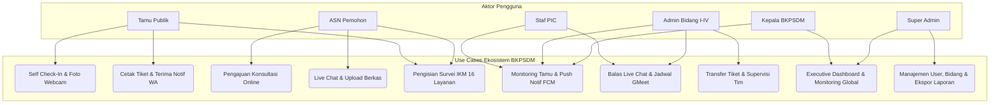
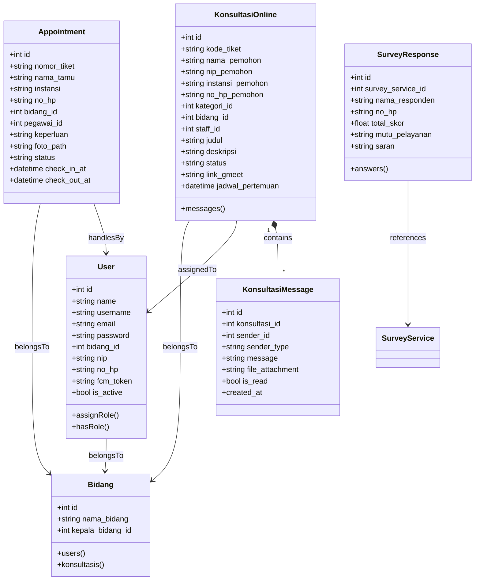
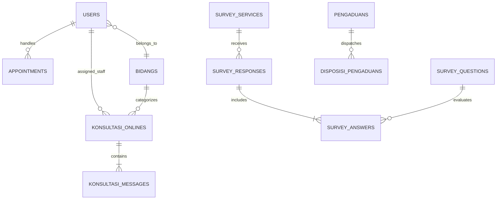
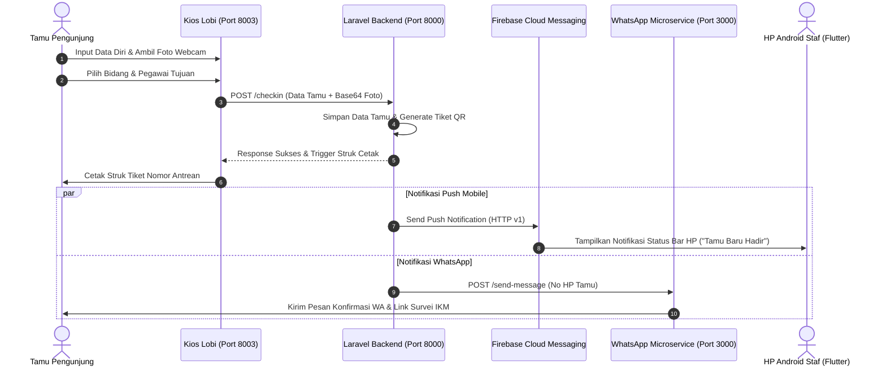
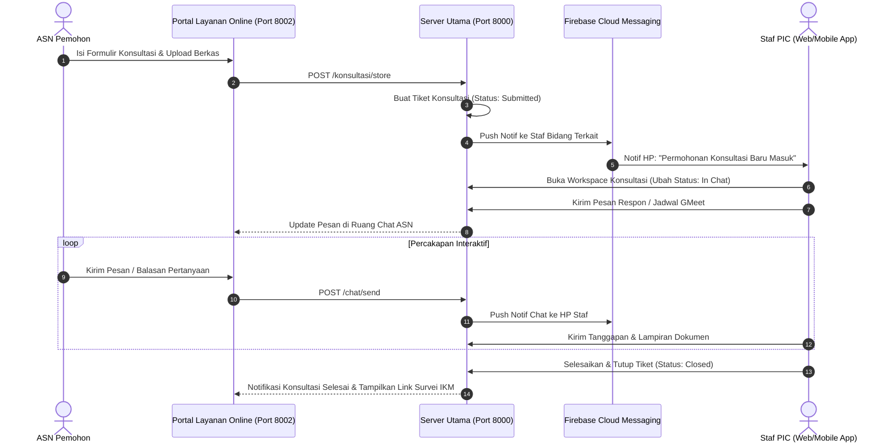
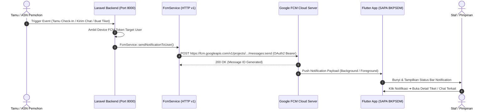

# RANCANG BANGUN SISTEM BACKEND, RESTFUL API GATEWAY, DAN INTEGRASI MULTI-SERVICE PELAYANAN, PENGADUAN, DAN KONSULTASI ONLINE ASN PADA BADAN KEPEGAWAIAN DAN PENGEMBANGAN SUMBER DAYA MANUSIA (BKPSDM) KABUPATEN BANJARNEGARA

**LAPORAN KERJA PRAKTIK**

*(Logo Universitas Jenderal Soedirman)*

**Oleh:**  
**IQSAN AZHAR NURYADI**  
**H1D024009**

**KEMENTERIAN PENDIDIKAN TINGGI, SAINS, DAN TEKNOLOGI**  
**UNIVERSITAS JENDERAL SOEDIRMAN**  
**FAKULTAS TEKNIK**  
**JURUSAN INFORMATIKA**  
**PURBALINGGA**  
**2026**

---

## PERNYATAAN

Saya yang bertanda tangan di bawah ini:

* **Nama**: IQSAN AZHAR NURYADI
* **NIM**: H1D024009

Menyatakan dengan sebenar-benarnya bahwa laporan kerja praktik saya yang berjudul:

**RANCANG BANGUN SISTEM BACKEND, RESTFUL API GATEWAY, DAN INTEGRASI MULTI-SERVICE PELAYANAN, PENGADUAN, DAN KONSULTASI ONLINE ASN PADA BADAN KEPEGAWAIAN DAN PENGEMBANGAN SUMBER DAYA MANUSIA (BKPSDM) KABUPATEN BANJARNEGARA**

Adalah hasil karya sendiri dan bukan jiplakan hasil karya orang lain.

Demikian pernyataan ini saya buat dengan sebenar-benarnya. Jika di kemudian hari terbukti bahwa laporan kerja praktik saya merupakan hasil jiplakan, maka saya bersedia menerima sanksi apapun yang diberikan sesuai ketentuan peraturan perundang-undangan yang berlaku.

Purbalingga, 14 Agustus 2026

*(Tanda Tangan)*

**IQSAN AZHAR NURYADI**

---

## LEMBAR PENGESAHAN

**LAPORAN KERJA PRAKTIK**

**RANCANG BANGUN SISTEM BACKEND, RESTFUL API GATEWAY, DAN INTEGRASI MULTI-SERVICE PELAYANAN, PENGADUAN, DAN KONSULTASI ONLINE ASN PADA BADAN KEPEGAWAIAN DAN PENGEMBANGAN SUMBER DAYA MANUSIA (BKPSDM) KABUPATEN BANJARNEGARA**

Disusun oleh:  
**IQSAN AZHAR NURYADI**  
**H1D024009**

Diterima dan disetujui oleh:  
Pada tanggal: .........................

| Dosen Pembimbing | Pembimbing Lapangan |
| :--- | :--- |
| *(Tanda Tangan)*<br><br><br>**Drs. Ir. Eddy Maryanto, M.Cs**<br>NIP. 196711101993031025 | *(Cap BKPSDM & Tanda Tangan)*<br><br><br>**Noviar Bagus Sulistyanto, S.Kom**<br>NIP. 198801012015030115 |

Mengetahui,  
Ketua Jurusan Informatika  
Fakultas Teknik Universitas Jenderal Soedirman

*(Tanda Tangan)*

**Dr. Lasmedi Afuan, S.T., M.Cs.**  
NIP. 198505102008121002

---

## DAFTAR ISI

* **DAFTAR ISI** — iii
* **DAFTAR GAMBAR** — vii
* **DAFTAR TABEL** — viii
* **BAB I PENDAHULUAN** — 1
  * 1.1 Latar Belakang — 1
  * 1.2 Rumusan Masalah — 3
  * 1.3 Pertanyaan Penelitian — 4
  * 1.4 Batasan Masalah — 4
  * 1.5 Tujuan Kerja Praktik — 6
  * 1.6 Kegunaan Kerja Praktik — 7
  * 1.7 Tempat Kerja Praktik — 8
  * 1.8 Waktu Pelaksanaan Kerja Praktik — 8
* **BAB II TINJAUAN PUSTAKA** — 9
  * 2.1 Pelayanan Publik dan Kepegawaian Daerah — 9
    * 2.1.1 BKPSDM sebagai Pengelola Manajemen ASN Daerah — 9
    * 2.1.2 Pelayanan Tamu Fisik dan Manajemen Janji Temu (Appointment) — 10
    * 2.1.3 Pengelolaan Pengaduan Masyarakat (Whistleblowing & Aspirasi) — 11
    * 2.1.4 Konsultasi Kepegawaian Online Daring (Live Chat & Virtual Meeting) — 11
    * 2.1.5 Survei Indeks Kepuasan Masyarakat (PermenPAN-RB No. 14 Tahun 2017) — 12
  * 2.2 Sistem Informasi Manajemen Pelayanan Terpadu — 13
  * 2.3 Arsitektur Multi-Service, Microservice, dan Shared Storage — 14
  * 2.4 Teknologi Pengembangan Perangkat Lunak Backend & API — 15
    * 2.4.1 Bahasa Pemrograman PHP dan Framework Laravel 13 — 15
    * 2.4.2 Bahasa Pemrograman Dart dan Framework Flutter 3.x — 16
    * 2.4.3 Basis Data Relasional MySQL — 17
    * 2.4.4 RESTful API dan Laravel Sanctum — 17
    * 2.4.5 Firebase Cloud Messaging (FCM) HTTP v1 & Push Notification — 18
    * 2.4.6 Node.js, Express.js, dan WhatsApp Baileys Multi-Device API — 19
    * 2.4.7 Tailwind CSS, Livewire 3, dan Alpine.js — 19
  * 2.5 Role-Based Access Control (RBAC) pada Tata Kelola 4 Bidang — 20
  * 2.6 Flowchart (Diagram Alir) — 21
  * 2.7 Unified Modeling Language (UML) — 21
    * 2.7.1 Use Case Diagram — 21
    * 2.7.2 Sequence Diagram — 22
    * 2.7.3 Class Diagram — 22
  * 2.8 Entity Relationship Diagram (ERD) — 22
  * 2.9 User Acceptance Testing (UAT) — 23
  * 2.10 Metodologi Agile Scrum — 23
  * 2.11 Penelitian Terdahulu — 25
* **BAB III PELAKSANAAN KERJA PRAKTIK** — 28
  * 3.1 Profil Instansi — 28
    * 3.1.1 Sejarah dan Profil BKPSDM Kabupaten Banjarnegara — 28
    * 3.1.2 Struktur Organisasi dan Tugas 4 Bidang Layanan — 29
    * 3.1.3 Visi dan Misi BKPSDM Kabupaten Banjarnegara — 31
  * 3.2 Pelaksanaan Kerja Praktik — 32
    * 3.2.1 Tahap Persiapan — 32
    * 3.2.2 Tahap Pelaksanaan — 33
  * 3.3 Metode Implementasi — 33
    * 3.3.1 Product Backlog — 34
    * 3.3.2 Sprint Planning — 34
    * 3.3.3 Sprint dan Daily Scrum — 35
    * 3.3.4 Sprint Review — 35
    * 3.3.5 Sprint Retrospective — 36
* **BAB IV IMPLEMENTASI** — 37
  * 4.1 Product Backlog — 37
    * 4.1.1 Identifikasi Pengguna — 37
    * 4.1.2 Kebutuhan Pengguna — 38
    * 4.1.3 Kebutuhan Sistem (Fungsional & Non-Fungsional) — 46
    * 4.1.4 Pembagian Sprint — 48
  * 4.2 Sprint Planning — 49
    * 4.2.1 Sprint Planning Sprint 1 — 49
    * 4.2.2 Sprint Planning Sprint 2 — 50
    * 4.2.3 Sprint Planning Sprint 3 — 51
    * 4.2.4 Sprint Planning Sprint 4 — 52
  * 4.3 Sprint dan Daily Scrum — 53
    * 4.3.1 Sprint 1 (Fondasi Backend, Database, RBAC & Multi-Port Routing) — 53
    * 4.3.2 Sprint 2 (Kios Tamu Lobi, Buku Tamu Onsite, Janji Temu & Pengaduan) — 60
    * 4.3.3 Sprint 3 (Portal Layanan Online ASN, Live Chat, Survei IKM & WA Bot) — 67
    * 4.3.4 Sprint 4 (REST API Gateway, Mobile Flutter SAPA BKPSDM, FCM & Laporan) — 74
  * 4.4 Sprint Review — 83
    * 4.4.1 Sprint Review Sprint 1 — 83
    * 4.4.2 Sprint Review Sprint 2 — 84
    * 4.4.3 Sprint Review Sprint 3 — 84
    * 4.4.4 Sprint Review Sprint 4 — 85
  * 4.5 Sprint Retrospective — 85
    * 4.5.1 Sprint Retrospective Sprint 1 — 85
    * 4.5.2 Sprint Retrospective Sprint 2 — 86
    * 4.5.3 Sprint Retrospective Sprint 3 — 86
    * 4.5.4 Sprint Retrospective Sprint 4 — 87
  * 4.6 User Acceptance Testing (UAT) — 87
* **BAB V PENUTUP** — 94
  * 5.1 Kesimpulan — 94
  * 5.2 Saran — 95
* **DAFTAR PUSTAKA** — 97
* **LAMPIRAN 1 SERTIFIKAT KELULUSAN** — 100
* **LAMPIRAN 2 SURAT PENERIMAAN INSTANSI** — 101
* **LAMPIRAN 3 PENILAIAN PELAKSANAAN KERJA PRAKTIK** — 102
* **LAMPIRAN 4 LEMBAR PRESENSI KERJA PRAKTIK** — 103
* **LAMPIRAN 5 LOGBOOK KERJA PRAKTIK** — 107
* **LAMPIRAN 6 DOKUMENTASI USER ACCEPTANCE TESTING (UAT)** — 114
* **LAMPIRAN 7 DOKUMENTASI KEGIATAN** — 118
* **LAMPIRAN 8 CURRICULUM VITAE** — 120

---

## DAFTAR GAMBAR

* Gambar 1. Arsitektur Multi-Service dan Backend API Gateway BKPSDM Banjarnegara — 15
* Gambar 2. Use Case Diagram Ekosistem Pelayanan BKPSDM — 54
* Gambar 3. Class Diagram Relasi Database Terpadu — 56
* Gambar 4. Entity Relationship Diagram (ERD) Sistem BKPSDM — 58
* Gambar 5. Halaman Login Multi-Role Portal Admin BKPSDM — 59
* Gambar 6. Halaman Manajemen Master Pengguna dan Bidang — 60
* Gambar 7. Flowchart Alur Check-In Tamu Mandiri di Kios Lobi — 61
* Gambar 8. Sequence Diagram Check-In Tamu dan Trigger Notifikasi — 62
* Gambar 9. Tampilan Kios Digital Self Check-In Tamu di Lobi (Port 8003) — 63
* Gambar 10. Tampilan Modal Snapshot Foto Webcam dan Cetak Tiket Tamu — 64
* Gambar 11. Halaman Manajemen Data Tamu dan Janji Temu Admin (Port 8000) — 65
* Gambar 12. Halaman Modul Pengaduan Masyarakat dan Tindak Lanjut — 66
* Gambar 13. Flowchart Alur Layanan Konsultasi Online ASN dan Live Chat — 68
* Gambar 14. Sequence Diagram Ruang Chat Interaktif ASN dan Staf — 69
* Gambar 15. Tampilan Halaman Beranda (Landing Page) Portal Layanan Online BKPSDM (Port 8002) — 70
* Gambar 16. Tampilan Dashboard Portal Pegawai ASN Terautentikasi (Port 8002) — 71
* Gambar 17. Tampilan Portal Formulir Pengajuan Konsultasi Online (Port 8002) — 72
* Gambar 18. Tampilan Ruang Live Chat Interaktif ASN Pemohon dan Staf — 73
* Gambar 19. Tampilan Portal Pengisian Survei IKM 16 Layanan (Port 8001) — 74
* Gambar 20. Terminal WhatsApp Gateway Bot Node.js (Port 3000) — 75
* Gambar 21. Flowchart Integrasi REST API Gateway dan Push Notification FCM — 76
* Gambar 22. Sequence Diagram Push Notification FCM ke Mobile Staf — 77
* Gambar 23. Tampilan Halaman Login dan Pengaturan Server Dinamis SAPA BKPSDM — 78
* Gambar 24. Tampilan Dashboard Bento Grid dan Live Status Tamu SAPA BKPSDM — 79
* Gambar 25. Tampilan Workspace Konsultasi Berbasis Scope Peran pada Mobile — 80
* Gambar 26. Tampilan Ruang Chat Interaktif dan Quick Responses pada Mobile — 81
* Gambar 27. Tampilan Monitoring Buku Tamu dan Riwayat Kunjungan pada Mobile — 82
* Gambar 28. Tampilan Kalender Janji Temu dan Agenda Pertemuan pada Mobile SAPA BKPSDM — 83
* Gambar 29. Tampilan Pengaturan Profil Akun dan Konfigurasi Tema pada Mobile — 84
* Gambar 30. Tampilan Ekspor Laporan Rekapitulasi PDF dan Excel — 85

---

## DAFTAR TABEL

* Table 1. Identifikasi Pengguna Sistem — 37
* Table 2. Kebutuhan Pengguna: Tamu / Pengunjung Publik — 39
* Table 3. Kebutuhan Pengguna: ASN Pemohon Konsultasi — 40
* Table 4. Kebutuhan Pengguna: Staf PIC Layanan — 41
* Table 5. Kebutuhan Pengguna: Admin Bidang I–IV — 43
* Table 6. Kebutuhan Pengguna: Kepala BKPSDM (Pimpinan) — 44
* Table 7. Kebutuhan Pengguna: Super Administrator — 45
* Table 8. Kebutuhan Fungsional dan Non-Fungsional Sistem — 46
* Table 9. Pembagian Sprint Pengembangan Sistem — 48
* Table 10. Pengujian UAT Skenario Super Administrator — 88
* Table 11. Pengujian UAT Skenario Admin Bidang & Staf PIC — 90
* Table 12. Pengujian UAT Skenario Pengguna Publik & ASN Pemohon — 92
* Table 13. Rekapitulasi Hasil Akhir User Acceptance Testing (UAT) — 93

---

## BAB I  
## PENDAHULUAN

### 1.1 Latar Belakang
Badan Kepegawaian dan Pengembangan Sumber Daya Manusia (BKPSDM) Pemerintah Kabupaten Banjarnegara merupakan instansi pelaksana fungsi penunjang urusan pemerintahan di bidang kepegawaian, pendidikan, dan pelatihan aparatur sipil negara (ASN) di tingkat daerah. Sebagai pusat tata kelola manajemen aparatur daerah, BKPSDM melayani ribuan ASN dan masyarakat umum setiap tahunnya. Ruang lingkup layanan tersebut mencakup empat unit kerja struktural utama, yaitu: (1) Sekretariat (pelayanan umum, persuratan, perizinan cuti, dan pensiun); (2) Bidang Pengadaan, Pengembangan Kompetensi dan Informasi (layanan data SIMPEG, E-Kinerja, diklat kepemimpinan, tugas belajar, serta pengadaan ASN); (3) Bidang Mutasi dan Promosi (kenaikan pangkat, kenaikan gaji berkala, rekomendasi mutasi pegawai, dan ujian dinas); serta (4) Bidang Penilaian Kinerja Aparatur dan Penghargaan (penilaian kinerja, penghargaan, pembinaan disiplin, dan izin perceraian).

Tingginya intensitas pelayanan tatap muka maupun konsultasi administratif mengharuskan BKPSDM memiliki sistem manajemen interaksi layanan yang efektif, transparan, terintegrasi, dan terdokumentasi dengan baik. Namun, dalam kenyataan operasional sehari-hari, mekanisme pelayanan di BKPSDM Kabupaten Banjarnegara masih menghadapi berbagai kendala fundamental:

1. **Pencatatan Tamu Fisik Masih Bersifat Manual dan Konvensional:**
   Pencatatan tamu yang datang langsung ke kantor masih menggunakan buku tamu manual berbahan kertas di meja resepsionis lobi. Pendekatan ini rentan terhadap ketidakterbacaan tulisan tangan, risiko kehilangan atau kerusakan arsip fisik, ketiadaan verifikasi identitas visual (foto tamu), serta menyulitkan resepsionis untuk mengetahui secara *real-time* ketersediaan staf atau pejabat bidang yang hendak ditemui.
2. **Ketiadaan Notifikasi Instan Kedatangan Tamu kepada Staf PIC:**
   Saat pengunjung check-in di lobi, resepsionis harus menelepon atau mendatangi ruangan bidang di lantai atas secara manual. Hal ini mengakibatkan penumpukan antrean tamu di ruang tunggu dan waktu tunggu (*waiting time*) yang tidak terukur secara objektif.
3. **Mekanisme Konsultasi ASN dan Pengaduan Belum Terintegrasi:**
   Konsultasi teknis seperti kendala akun SIMPEG/E-Kinerja, pengurusan berkas kenaikan pangkat, atau perizinan cuti antar-ASN dari berbagai Organisasi Perangkat Daerah (OPD) dan instansi kecamatan seringkali dilakukan melalui pesan pribadi WhatsApp staf secara sporadis atau mengharuskan ASN datang langsung menempuh jarak yang jauh ke kantor BKPSDM. Hal ini menyebabkan beban kerja staf tidak merata, tidak adanya riwayat tiket (*ticket tracking*), tidak adanya pencatatan resmi notulensi hasil konsultasi, serta tidak adanya alur disposisi pengaduan masyarakat yang terstruktur.
4. **Pengukuran Survei Kepuasan Masyarakat (IKM) Belum Terautomasi:**
   Pengukuran Indeks Kepuasan Masyarakat (IKM) atas 16 jenis layanan kepegawaian sebagaimana diamanatkan dalam Peraturan Menteri Pendayagunaan Aparatur Negara dan Reformasi Birokrasi (PermenPAN-RB) No. 14 Tahun 2017 masih diolah secara parsial. Hal ini menyebabkan kalkulasi Nilai Rata-rata Tertimbang (NRR) dan konversi mutu pelayanan (A/B/C/D) membutuhkan waktu rekapitulasi yang lama.
5. **Keterbatasan Mobilitas Pimpinan dan Staf:**
   Pimpinan (Kepala Badan) dan Admin Bidang memiliki mobilitas tinggi dalam tugas kedinasan di luar kantor, sehingga membutuhkan sarana pemantauan (*monitoring dashboard*) serta notifikasi langsung pada *smartphone* untuk memantau tamu penting yang hadir, mendisposisikan pengaduan masuk, maupun merespons konsultasi daring.

Guna mengatasi keseluruhan problematika tersebut secara menyeluruh, dibutuhkan pengembangan **Sistem Backend, RESTful API Gateway, dan Integrasi Multi-Service Pelayanan, Pengaduan, dan Konsultasi Online ASN** yang menggabungkan aplikasi berbasis Web dan Mobile (Android). Sistem ini dirancang mengadopsi arsitektur *multi-service* yang saling terhubung melalui *shared database* MySQL dan RESTful API Gateway berbasis Laravel 13, dengan modul khusus yang terbagi ke dalam port independen: Kios Digital Buku Tamu Lobi (Port 8003), Portal Layanan Online & Live Chat ASN (Port 8002), Portal Publik Survei IKM 16 Layanan (Port 8001), Portal Admin & Server Utama (Port 8000), Microservice WhatsApp Gateway Bot berbasis Node.js Baileys (Port 3000), serta Aplikasi Mobile Android **SAPA BKPSDM** (*Sistem Akses Pelayanan & Konsultasi Aparatur*) berbasis Flutter dengan integrasi Push Notification **Firebase Cloud Messaging (FCM)**.

Kegiatan Kerja Praktik di BKPSDM Kabupaten Banjarnegara ini merupakan wahana penerapan keilmuan Rekayasa Perangkat Lunak, Arsitektur Backend, Web Full-Stack, Pengembangan API Gateway, Mobile App Development, dan Manajemen Basis Data dalam menjawab kebutuhan transformasi digital pelayanan publik pemerintah daerah secara nyata.

---

### 1.2 Rumusan Masalah
Berdasarkan latar belakang di atas, rumusan masalah yang diselesaikan dalam kerja praktik ini adalah:
* **a.** Proses registrasi tamu di lobi BKPSDM masih menggunakan buku kertas fisik yang rentan hilang, tanpa verifikasi foto/tanda tangan, serta belum terintegrasi dengan sistem notifikasi otomatis ke staf bidang terkait.
* **b.** Belum tersedianya arsitektur backend dan RESTful API Gateway terpadu yang melayani portal konsultasi online mandiri antar-ASN dan pengaduan masyarakat terstruktur dengan alur tiket (*ticket tracking*), ruang *live chat* dua arah, dan mekanisme disposisi penanganan per bidang.
* **c.** Pengumpulan dan pengolahan data Survei Indeks Kepuasan Masyarakat (IKM) atas 16 layanan spesifik 4 bidang kepegawaian belum terpusat secara digital dan belum menghitung nilai mutu pelayanan (A/B/C/D) secara otomatis real-time pada layer database dan backend.
* **d.** Pimpinan dan staf belum memiliki backend push notification gateway yang mampu mengirimkan *push notification* status bar langsung ke *smartphone* Android saat terjadi kedatangan tamu, pengaduan masuk, atau percakapan konsultasi baru.

---

### 1.3 Pertanyaan Penelitian
Berdasarkan rumusan masalah yang telah diidentifikasi, disusun pertanyaan penelitian sebagai berikut:
* **a.** Bagaimana merancang dan membangun arsitektur sistem backend, database terpadu, dan RESTful API Gateway yang mengintegrasikan Kios Tamu Mandiri, Portal Konsultasi Online Live Chat, Portal Survei IKM, dan Portal Admin 4 Bidang BKPSDM Banjarnegara?
* **b.** Bagaimana mengimplementasikan arsitektur backend *multi-service* dengan *shared database*, RESTful API Gateway Laravel Sanctum, integrasi WhatsApp Bot Microservice (Baileys), dan Push Notification Firebase Cloud Messaging (FCM) HTTP v1 pada aplikasi mobile Flutter SAPA BKPSDM?
* **c.** Bagaimana merancang mekanisme kontrol akses berbasis peran (Role-Based Access Control) pada sisi backend untuk 7 tingkatan pengguna (*Super Admin*, *Kepala BKPSDM*, *Admin Bidang I–IV*, *Staf PIC*, *Resepsionis*, *ASN Pemohon*, dan *Tamu Publik*) guna menjamin keamanan serta akuntabilitas data?

---

### 1.4 Batasan Masalah
Agar pelaksanaan kerja praktik terfokus dan sesuai dengan ruang lingkup yang disepakati, ditetapkan batasan masalah sebagai berikut:
* **a.** Sistem dikembangkan secara spesifik untuk tata kelola backend pelayanan, pengaduan, dan konsultasi kepegawaian pada **Badan Kepegawaian dan Pengembangan Sumber Daya Manusia (BKPSDM) Kabupaten Banjarnegara**.
* **b.** Arsitektur backend utama dibangun menggunakan bahasa pemrograman **PHP 8.2+** dengan framework **Laravel 13**, didukung **Livewire 3**, **Alpine.js**, dan **Tailwind CSS**, dengan basis data relasional terpusat **MySQL 8**.
* **c.** Endpoint API Gateway dikembangkan menggunakan **Laravel Sanctum** untuk melayani pertukaran data aplikasi mobile staf dan pimpinan (**SAPA BKPSDM**) berbasis **Flutter 3.x (Dart)** pada platform **Android** (SDK API 21+ Lollipop s.d. API 34 Android 14).
* **d.** Layanan notifikasi backend diimplementasikan menggunakan: (1) **WhatsApp Gateway Bot** berbasis Node.js/Express dan library Baileys (Multi-Device API) pada port `3000`, serta (2) **Push Notification Firebase Cloud Messaging (FCM)** menggunakan Google Service Account HTTP v1 API.
* **e.** Pembagian portal layanan web berbasis port lokal:
  - Portal Admin, Backend Utama & API Gateway: `http://localhost:8000`
  - Portal Kios Check-In Tamu Mandiri Lobi: `http://localhost:8003`
  - Portal Layanan Konsultasi Online ASN & Live Chat: `http://localhost:8002`
  - Portal Publik Survei IKM 16 Layanan: `http://localhost:8001`
  - Microservice WhatsApp Gateway Bot: `http://localhost:3000`
* **f.** Survei Indeks Kepuasan Masyarakat (IKM) dibatasi pada 9 unsur pelayanan publik dengan skala Likert 1–4 sesuai regulasi PermenPAN-RB No. 14 Tahun 2017 untuk 16 jenis layanan di 4 bidang BKPSDM.
* **g.** Sistem tidak mencakup integrasi transaksi keuangan (*Payment Gateway*), integrasi biometrik pemindai sidik jari/retina fisik khusus, sinkronisasi API langsung secara tertutup ke database BKN pusat (SIASN/MyASN), maupun pengembangan aplikasi mobile berbasis Apple iOS.
* **h.** Pengujian perangkat lunak dilakukan pada lingkungan lokal dan jaringan intranet lokal (LAN/Wi-Fi) BKPSDM dengan pengujian fungsionalitas, integrasi layanan, serta User Acceptance Testing (UAT) bersama pegawai BKPSDM.

---

### 1.5 Tujuan Kerja Praktik
Tujuan yang dicapai melalui pelaksanaan kerja praktik ini adalah:
* **a.** Memenuhi persyaratan kurikulum dan kelulusan mata kuliah Kerja Praktik pada Program Studi Informatika, Jurusan Informatika, Fakultas Teknik, Universitas Jenderal Soedirman.
* **b.** Merancang dan membangun arsitektur backend dan database terpusat yang mendukung Kios Digital Buku Tamu mandiri dengan fitur verifikasi foto *webcam*, pencetakan tiket nomor antrean/QR Code, dan pemicu notifikasi otomatis kedatangan tamu ke staf bidang.
* **c.** Merancang dan mengimplementasikan backend Portal Layanan Online ASN yang menyediakan pengajuan tiket konsultasi kepegawaian, ruang *live chat* dua arah secara *real-time*, pengunggahan berkas bukti ke shared storage, dan opsi pengalihan (*transfer*) tiket konsultasi.
* **d.** Mengembangkan backend kalkulasi otomatis untuk Portal Survei IKM publik 16 jenis layanan kepegawaian dengan perhitungan Nilai Rata-rata Tertimbang (NRR) dan pemetaan Mutu Pelayanan (A/B/C/D).
* **e.** Membangun RESTful API Gateway Sanctum dan integrasi Push Notification **Firebase Cloud Messaging (FCM)** untuk aplikasi mobile Android **SAPA BKPSDM** berbasis Flutter guna memonitor buku tamu, merespons *live chat*, dan mengelola janji temu secara instan.
* **f.** Mengimplementasikan integrasi multi-layanan melalui otomasi script `jalankan_semua.bat` dan menyusun dokumentasi teknis implementasi sistem secara lengkap.

---

### 1.6 Kegunaan Kerja Praktik
Pelaksanaan kerja praktik ini memberikan manfaat bagi berbagai pihak:

**1. Bagi Mahasiswa:**
* Menerapkan kompetensi akademik di bidang Rekayasa Perangkat Lunak, Arsitektur Backend, RESTful API Gateway, Mobile App Development, dan Database Management pada sistem berskala nyata di instansi pemerintah daerah.
* Memperoleh pengalaman praktis dalam merancang arsitektur backend *multi-service*, token authentication Sanctum, *state management* Flutter, integrasi Firebase FCM HTTP v1, dan microservice WhatsApp Bot.
* Melatih kemampuan komunikasi profesional, analisis kebutuhan pengguna birokrasi, serta manajemen proyek berbasis metodologi Agile Scrum.

**2. Bagi BKPSDM Kabupaten Banjarnegara:**
* Mewujudkan digitalisasi pelayanan tamu lobi yang tertib, modern, tervalidasi foto, dan bebas dari tumpukan berkas kertas.
* Meningkatkan kecepatan respon staf terhadap kehadiran tamu dan pengajuan konsultasi kepegawaian berkat adanya notifikasi WhatsApp dan push notification HP.
* Menyediakan ruang konsultasi daring terpusat bagi ASN dari seluruh kecamatan dan OPD tanpa harus menempuh perjalanan jauh ke kantor BKPSDM.
* Mempermudah pimpinan dan bidang dalam memperoleh data statistik analitik kunjungan, rekapitulasi pengaduan, dan nilai mutu IKM secara otomatis untuk bahan evaluasi pelayanan berkala.

**3. Bagi Universitas Jenderal Soedirman:**
* Mempererat jalinan kemitraan strategis antara institusi perguruan tinggi dengan pemerintah daerah (BKPSDM Kabupaten Banjarnegara).
* Menjadi tolok ukur kesesuaian materi kurikulum akademik Jurusan Informatika dengan dinamika kebutuhan implementasi teknologi di sektor publik.
* Meningkatkan reputasi akademis institusi melalui karya nyata mahasiswa dalam rekayasa sistem informasi modern.

---

### 1.7 Tempat Kerja Praktik
Kerja praktik dilaksanakan pada:
* **Instansi**: Badan Kepegawaian dan Pengembangan Sumber Daya Manusia (BKPSDM) Pemerintah Kabupaten Banjarnegara
* **Alamat**: Jl. Mayjend Soetoyo No. 53, Kauman, Kecamatan Banjarnegara, Kabupaten Banjarnegara, Jawa Tengah 53415
* **Unit Penempatan**: Sub Bagian Umum dan Kepegawaian (Sekretariat) serta Bidang Pengadaan, Pengembangan Kompetensi dan Informasi

---

### 1.8 Waktu Pelaksanaan Kerja Praktik
Kerja praktik dilaksanakan selama satu bulan penuh, terhitung mulai tanggal **13 Juli 2026** sampai dengan **13 Agustus 2026**. Waktu kerja harian mengikuti ketentuan jam operasional kedinasan Pemerintah Kabupaten Banjarnegara, yaitu hari Senin sampai dengan Jumat, pukul 07.30 hingga 16.00 WIB.

---

## BAB II  
## TINJAUAN PUSTAKA

### 2.1 Pelayanan Publik dan Kepegawaian Daerah

#### 2.1.1 BKPSDM sebagai Pengelola Manajemen ASN Daerah
Berdasarkan Undang-Undang No. 20 Tahun 2023 tentang Aparatur Sipil Negara dan peraturan perundang-undangan terkait tata kelola kepegawaian daerah, Badan Kepegawaian dan Pengembangan Sumber Daya Manusia (BKPSDM) memiliki mandat strategis dalam merencanakan formasi, menyelenggarakan pengadaan, memfasilitasi pengembangan karier dan kompetensi, mengelola mutasi serta promosi, hingga mengevaluasi kinerja dan kesejahteraan seluruh ASN di lingkungan pemerintah kabupaten. Transformasi pelayanan kepegawaian berbasis Sistem Pemerintahan Berbasis Elektronik (SPBE) menjadi prasyarat mutlak untuk menciptakan birokrasi yang lincah (*agile*), transparan, dan akuntabel.

#### 2.1.2 Pelayanan Tamu Fisik dan Manajemen Janji Temu (Appointment)
Pelayanan tamu di lingkungan kantor pemerintah seringkali dihadapkan pada kendala antrean, ketiadaan verifikasi identitas visual, serta jeda waktu konfirmasi antara meja depan (*front desk*) dengan staf penerima di ruangan bidang (*back office*). Sistem buku tamu digital berbasis *web-kiosk self-service* memungkinkan pengunjung melakukan check-in mandiri dengan menginput identitas (Nama, NIK/NIP, Asal Instansi, No. WhatsApp), memilih bidang/staf tujuan, serta mengambil potret diri (*webcam snapshot*). Di samping itu, fitur janji temu (*appointment scheduling*) memfasilitasi penjadwalan konsultasi tatap muka pada hari dan jam tertentu, sehingga staf terkait dapat mempersiapkan berkas dokumen yang dibutuhkan sebelum tamu hadir.

#### 2.1.3 Pengelolaan Pengaduan Masyarakat (Whistleblowing & Aspirasi)
Pengaduan masyarakat merupakan instrumen penting dalam kendali mutu dan pengawasan integritas aparatur sipil negara. Pengelolaan aduan yang efektif memerlukan klasifikasi kategori aduan (Pelayanan Kepegawaian, Disiplin Pegawai, Fasilitas & Infrastruktur, atau Lainnya), penyediaan sarana unggah dokumen bukti pendukung, pelacakan nomor tiket (*ticket tracking*), serta alur disposisi berjenjang dari Admin Sekretariat ke Kepala Bidang yang berwenang untuk memberikan tindak lanjut dan tanggapan resmi.

#### 2.1.4 Konsultasi Kepegawaian Online Daring (Live Chat & Virtual Meeting)
Geografis Kabupaten Banjarnegara yang terdiri atas 20 kecamatan menuntut efisiensi waktu dan biaya transportasi bagi ASN di wilayah pelosok yang ingin berkonsultasi mengenai administrasi kepegawaian (seperti verifikasi data SIMPEG, kenaikan pangkat, izin belajar, dan cuti). Portal Layanan Online dengan fitur *Live Chat* dua arah memungkinkan ASN berdialog langsung dengan staf bidang yang berkompeten, bertukar lampiran dokumen secara digital, serta menerima tautan rapat virtual (*Google Meet*) apabila diperlukan pembahasan teknis yang lebih mendalam.

#### 2.1.5 Survei Indeks Kepuasan Masyarakat (PermenPAN-RB No. 14 Tahun 2017)
Survei Kepuasan Masyarakat (SKM/IKM) diselenggarakan sebagai instrumen pengukuran berkala atas mutu dan kinerja pelayanan publik. Mengacu pada Peraturan Menteri PAN-RB No. 14 Tahun 2017, kuesioner IKM mengukur 9 unsur pelayanan: (1) Persyaratan, (2) Sistem, Mekanisme, dan Prosedur, (3) Waktu Penyelesaian, (4) Biaya/Tarif, (5) Produk Spesifikasi Jenis Pelayanan, (6) Kompetensi Pelaksana, (7) Perilaku Pelaksana, (8) Penanganan Pengaduan, Saran, dan Masukan, serta (9) Sarana dan Prasarana. Setiap butir pertanyaan menggunakan skala Likert 1 sampai 4, yang selanjutnya dikalkulasi menggunakan rumus Nilai Rata-rata Tertimbang (NRR) dan dikonversi ke dalam 4 kategori Mutu Pelayanan:
* **Nilai IKM 25,00 – 64,99**: Mutu D (Tidak Baik)
* **Nilai IKM 65,00 – 76,60**: Mutu C (Kurang Baik)
* **Nilai IKM 76,61 – 88,30**: Mutu B (Baik)
* **Nilai IKM 88,31 – 100,00**: Mutu A (Sangat Baik)

---

### 2.2 Sistem Informasi Manajemen Pelayanan Terpadu
Sistem Informasi Manajemen (SIM) Pelayanan Terpadu adalah kesatuan platform digital yang mengintegrasikan seluruh titik kontak layanan (*touchpoints*), mulai dari lobi kantor fisik, portal mandiri daring, antarmuka administrasi internal, hingga aplikasi *mobile* operasional. Dengan memusatkan basis data transaksi pada layer backend, seluruh riwayat interaksi pengunjung dan pemohon tercatat secara utuh (*single source of truth*), mencegah terjadinya duplikasi data, meningkatkan kecepatan respon pelayanan (*service response time*), dan menyediakan data analitik real-time bagi para pemangku kepentingan.

---

### 2.3 Arsitektur Multi-Service, Microservice, dan Shared Storage
Dalam pengembangan sistem ini, diterapkan pendekatan arsitektur backend *multi-service* terpadu dengan pembagian peran modul berbasis *port binding* dan *shared storage*:

```text
                                  ┌─────────────────────────────┐
                                  │   Flutter Mobile App        │
                                  │   (SAPA BKPSDM Android)     │
                                  └──────────────┬──────────────┘
                                                 │ REST API (Bearer Token)
                                                 ▼
┌─────────────────────────┐       ┌─────────────────────────────┐       ┌─────────────────────────────┐
│  Form Tamu Onsite Lobi  │       │  Portal Admin & API Gateway │       │  Layanan Online ASN         │
│  (Port 8003 - Kios Web) │──────▶│  (Port 8000 - Laravel 13)   │◀──────│  (Port 8002 - Live Chat)    │
└─────────────────────────┘       └──────┬──────────────┬───────┘       └─────────────────────────────┘
                                         │              │
                                         │              ▼
┌─────────────────────────┐              │       ┌─────────────────────────────┐
│  Survei IKM 16 Layanan  │──────────────┤       │  Microservice WhatsApp Bot  │
│  (Port 8001 - Publik)   │              │       │  (Port 3000 - Node/Baileys) │
└─────────────────────────┘              │       └─────────────────────────────┘
                                         ▼
                 ┌───────────────────────────────────────────────┐
                 │          Shared MySQL Database & Storage      │
                 │          (Database: bkpsdm_tamu_aduan)        │
                 └───────────────────────────────────────────────┘
```
*Gambar 1. Arsitektur Multi-Service dan Backend API Gateway BKPSDM Banjarnegara*

Keuntungan arsitektur ini:
1. **Pemisahan Beban Layanan (Decoupling):** Kios di lobi (Port 8003) dan Survei IKM (Port 8001) dapat diakses publik tanpa membebani antarmuka internal admin (Port 8000).
2. **Shared Storage:** Berkas lampiran aduan, foto webcam tamu, dan lampiran obrolan chat disimpan pada direktori bersama `shared_storage/` dan dapat diakses secara instan oleh seluruh modul melalui konfigurasi *symbolic link* (*symlink*).
3. **Pemberitahuan Asinkron:** Pengiriman pesan WhatsApp ditangani oleh microservice terpisah via panggilan webhook HTTP lokal, sementara pengiriman push notifikasi ditangani oleh Queue Worker Laravel.

---

### 2.4 Teknologi Pengembangan Perangkat Lunak Backend & API

#### 2.4.1 Bahasa Pemrograman PHP dan Framework Laravel 13
PHP (Hypertext Preprocessor) adalah bahasa skrip sisi server yang sangat matang dan luas digunakan dalam ekosistem aplikasi web enterprise. Framework **Laravel 13** menyediakan fondasi arsitektur Model-View-Controller (MVC) modern dengan fitur bawaan yang lengkap, seperti Eloquent ORM untuk manajemen relasi basis data yang ekspresif, routing yang fleksibel, middleware keamanan, dependency injection, queue workers untuk tugas latar belakang (*background jobs*), serta sistem seeder dan migrasi basis data yang terstruktur.

#### 2.4.2 Bahasa Pemrograman Dart dan Framework Flutter 3.x
**Dart** merupakan bahasa pemrograman berorientasi objek yang dirancang oleh Google dengan dukungan pengetikan statis (*strong typing*) dan kompilasi Ahead-of-Time (AOT) menjadi kode mesin asli (*native ARM code*). **Flutter** adalah toolkit antarmuka pengguna (UI) multiplatform dari Google yang menggunakan pendekatan *Everything is a Widget*. Dengan arsitektur rendering berbasis mesin grafis Skia/Impeller, Flutter menghasilkan performa antarmuka yang sangat mulus (60–120 FPS) dan bebas kedipan (*zero-flicker UI*). Manajemen state pada aplikasi mobile SAPA BKPSDM menggunakan pola **Provider Pattern** yang ringan, reaktif, dan mudah dirawat.

#### 2.4.3 Basis Data Relasional MySQL
**MySQL 8** merupakan Relational Database Management System (RDBMS) berbasis SQL yang menawarkan keandalan transaksi berstandar ACID (Atomicity, Consistency, Isolation, Durability), pengindeksan data berkecepatan tinggi, dan skalabilitas tinggi dalam menangani ribuan baris data transaksi tamu, log chat, dan kuesioner survei.

#### 2.4.4 RESTful API dan Laravel Sanctum
REST (Representational State Transfer) merupakan gaya arsitektur komunikasi data berbasis protokol HTTP dengan format pertukaran data JSON. **Laravel Sanctum** digunakan untuk menyediakan sistem autentikasi token berbasis *Personal Access Token* yang ringan bagi aplikasi mobile Flutter. Setiap permintaan API menyertakan header `Authorization: Bearer <token>` yang divalidasi secara aman pada middleware backend.

#### 2.4.5 Firebase Cloud Messaging (FCM) HTTP v1 & Push Notification
**Firebase Cloud Messaging (FCM)** dari Google merupakan layanan pengiriman pesan notifikasi lintas platform yang andal dan hemat daya baterai. Pada ekosistem ini, backend Laravel memanfaatkan protokol resmi **Google FCM HTTP v1 API** yang diautentikasi menggunakan file kredensial Google Service Account (`firebase-auth.json`). Saat tamu check-in atau ada permohonan konsultasi baru, backend secara otomatis memicu pengiriman pesan push notifikasi ke *device token* perangkat Android staf, yang segera memunculkan notifikasi status bar di HP staf meskipun aplikasi sedang dalam kondisi ditutup total (*killed/background*).

#### 2.4.6 Node.js, Express.js, dan WhatsApp Baileys Multi-Device API
**Node.js** adalah lingkungan eksekusi JavaScript berbasis asynchronous event-driven V8 engine. Library **Baileys** menghubungkan server dengan protokol WhatsApp Web Multi-Device secara langsung tanpa memerlukan nomor WhatsApp Business API berbayar. Server microservice Express.js yang berjalan pada port `3000` menyediakan endpoint REST HTTP `POST /send-message` yang dipanggil oleh Laravel setiap kali terdapat event kedatangan tamu atau penyelesaian layanan.

#### 2.4.7 Tailwind CSS, Livewire 3, dan Alpine.js
* **Tailwind CSS** adalah framework CSS utility-first yang memungkinkan perancangan tampilan modern, responsif, dan konsisten langsung di dalam berkas HTML/Blade.
* **Livewire 3** memungkinkan pembuatan antarmuka dinamis dan interaktif di sisi server tanpa perlu menulis banyak kode JavaScript manual.
* **Alpine.js** menyediakan interaktivitas ringan pada komponen sisi klien (seperti modal popup webcam, dropdown, dan tab switcher) secara deklaratif.

---

### 2.5 Role-Based Access Control (RBAC) pada Tata Kelola 4 Bidang
Model kendali akses berbasis peran (RBAC) membatasi akses data dan fitur berdasarkan tugas pokok dan fungsi (tupoksi) pengguna:
1. **Super Admin:** Memiliki hak akses penuh atas seluruh data sistem, konfigurasi server, manajemen pengguna, dan penghapusan data log.
2. **Kepala BKPSDM (Pimpinan):** Memiliki hak pantau (*monitoring scope*) terhadap seluruh bidang, melihat rekapitulasi eksekutif, dan menerima notifikasi tamu penting.
3. **Admin Bidang I (Sekretariat):** Mengelola buku tamu sekretariat, aduan publik, dan konsultasi kepegawaian umum/pensiun/cuti.
4. **Admin Bidang II (Pengadaan & Bangkom):** Mengelola antrean konsultasi data SIMPEG, E-Kinerja, diklat, dan formasi pengadaan ASN.
5. **Admin Bidang III (Mutasi & Promosi):** Mengelola konsultasi kenaikan pangkat, mutasi instansi, dan ujian dinas.
6. **Admin Bidang IV (Kinerja & Penghargaan):** Mengelola konsultasi SKP, penghargaan tanda kehormatan, dan penanganan disiplin.
7. **Staf PIC / Pegawai:** Mengakses tiket dan percakapan konsultasi yang ditugaskan khusus ke dirinya (*Tugas Saya*).
8. **Resepsionis:** Mengoperasikan meja depan, memeriksa kedatangan tamu, dan mencetak tiket kunjungan.
9. **Pengguna Eksternal (ASN Pemohon & Tamu Publik):** Mengisi form check-in lobi, mengajukan konsultasi, membalas obrolan chat tiket miliknya, dan mengisi survei IKM.

---

### 2.6 Flowchart (Diagram Alir)
Diagram alir digunakan untuk memvisualisasikan runtutan logika bisnis, percabangan keputusan, dan perpindahan status data secara grafis sehingga mudah dipahami oleh seluruh tim pengembang dan pihak instansi.

---

### 2.7 Unified Modeling Language (UML)
UML merupakan bahasa grafis standar industri untuk memodelkan struktur dan perilaku sistem perangkat lunak berorientasi objek:
* **Use Case Diagram:** Memetakan fungsionalitas sistem yang dapat diakses oleh masing-masing aktor.
* **Sequence Diagram:** Menjelaskan interaksi pesan antar-komponen/objek berdasarkan urutan waktu.
* **Class Diagram:** Menggambarkan struktur statis kelas model, atribut data, metode, serta hubungan asosiasi antar-tabel.

---

### 2.8 Entity Relationship Diagram (ERD)
ERD memodelkan arsitektur data konseptual dan logikal pada basis data MySQL, mencakup entitas pengguna, bidang, pegawai, tamu, janji temu (*appointment*), pengaduan, disposisi, konsultasi online, pesan live chat, butir pertanyaan survei, serta jawaban responden.

---

### 2.9 User Acceptance Testing (UAT)
User Acceptance Testing (UAT) adalah tahap evaluasi akhir yang dilakukan secara langsung oleh pengguna operasional di instansi untuk memverifikasi apakah fungsionalitas dan alur kerja perangkat lunak telah memenuhi kebutuhan riil sebelum sistem dinyatakan siap dioperasikan (*production-ready*).

---

### 2.10 Metodologi Agile Scrum
Pengembangan ekosistem ini menggunakan kerangka kerja **Agile Scrum** yang bersifat iteratif dan bertahap. Siklus pengembangan dibagi ke dalam **4 siklus Sprint** berdurasi mingguan, dengan peran *Product Owner* (Pembimbing Lapangan BKPSDM), *Scrum Master & Development Team* (Mahasiswa Kerja Praktik). Setiap siklus melewati tahapan *Sprint Planning*, *Daily Scrum*, *Sprint Review*, dan *Sprint Retrospective*.

---

### 2.11 Penelitian Terdahulu
Berbagai penelitian dan proyek implementasi sistem informasi pelayanan telah dilakukan pada instansi pemerintah, antara lain:
1. **Prasetyo et al. (2024)** mengembangkan sistem buku tamu digital berbasis web pada kantor dinas daerah dengan fitur QR Code, namun belum mengintegrasikan notifikasi pesan instan WhatsApp ke staf bidang.
2. **Kurniawan & Ramadhan (2025)** meneliti implementasi push notification Firebase Cloud Messaging pada aplikasi mobile absensi pegawai berbasis Flutter dan membuktikan peningkatan kecepatan penerimaan pesan hingga 95%.
3. **Hidayat et al. (2025)** merancang portal survei indeks kepuasan masyarakat berbasis PermenPAN-RB No. 14 Tahun 2017 menggunakan framework Laravel, namun sistem tersebut berdiri sendiri dan belum terhubung dengan portal pelayanan tamu dan konsultasi online.
4. **Wulandari & Santoso (2026)** membangun sistem layanan pengaduan kepegawaian berbasis web dengan alur disposisi, namun belum mengakomodasi konsultasi *real-time live chat* dan aplikasi mobile bagi pimpinan.

Ekosistem yang dibangun dalam kerja praktik ini hadir melengkapi celah tersebut dengan mengintegrasikan arsitektur backend Buku Tamu Kios Lobi, Pengaduan, Konsultasi Online Live Chat, Survei IKM 16 Layanan, WhatsApp Bot, Push Notification FCM, dan Mobile App Flutter SAPA BKPSDM ke dalam satu basis data terpadu dan arsitektur *multi-service* yang saling tersinkronisasi.

---

## BAB III  
## PELAKSANAAN KERJA PRAKTIK

### 3.1 Profil Instansi

#### 3.1.1 Sejarah dan Profil BKPSDM Kabupaten Banjarnegara
Badan Kepegawaian dan Pengembangan Sumber Daya Manusia (BKPSDM) Kabupaten Banjarnegara dibentuk berdasarkan Peraturan Daerah Kabupaten Banjarnegara tentang Pembentukan dan Susunan Perangkat Daerah guna menyelenggarakan urusan pemerintahan penunjang di bidang manajemen kepegawaian daerah. BKPSDM beralamat di Jl. Mayjend Soetoyo No. 53, Banjarnegara. Lembaga ini dipimpin oleh Kepala Badan yang bertanggung jawab langsung kepada Bupati melalui Sekretaris Daerah.

#### 3.1.2 Struktur Organisasi dan Tugas 4 Bidang Layanan
Struktur organisasi BKPSDM Kabupaten Banjarnegara terdiri atas:
1. **Kepala Badan:** Memimpin perumusan kebijakan teknis, pembinaan, pengoordinasian, dan pengawasan urusan kepegawaian daerah.
2. **Sekretariat:** Mengoordinasikan perencanaan program, keuangan, perlengkapan, tata usaha, persuratan, serta administrasi kepegawaian internal dan perizinan cuti/pensiun.
3. **Bidang Pengadaan, Pengembangan Kompetensi dan Informasi:** Melaksanakan perencanaan formasi, seleksi pengadaan ASN, pengelolaan data kepegawaian digital (SIMPEG & E-Kinerja), serta penyelenggaraan diklat kepemimpinan/teknis dan tugas belajar.
4. **Bidang Mutasi dan Promosi:** Mengelola mutasi jabatan struktural/fungsional, kenaikan pangkat reguler/pilihan, kenaikan gaji berkala, perpindahan antar-instansi, dan ujian dinas aparatur.
5. **Bidang Penilaian Kinerja Aparatur dan Penghargaan:** Melaksanakan evaluasi capaian SKP, pemberian tanda kehormatan/penghargaan, penanganan pelanggaran disiplin ASN, dan pengurusan izin perceraian.

#### 3.1.3 Visi dan Misi BKPSDM Kabupaten Banjarnegara
* **Visi**: *"Terwujudnya Manajemen ASN yang Profesional, Berintegritas, dan Berorientasi Pelayanan Menuju Banjarnegara yang Maju dan Sejahtera."*
* **Misi**:
  1. Meningkatkan profesionalisme, kompetensi, dan kapasitas aparatur sipil negara melalui pendidikan dan pelatihan berkelanjutan.
  2. Mewujudkan sistem merit dan tata kelola kepegawaian daerah yang berbasis digital, transparan, dan akuntabel.
  3. Meningkatkan kualitas pelayanan administrasi kepegawaian yang cepat, tepat, ramah, dan bebas dari pungutan liar.

---

### 3.2 Pelaksanaan Kerja Praktik

#### 3.2.1 Tahap Persiapan
Tahap persiapan dilaksanakan pada minggu pertama (13–17 Juli 2026), meliputi:
* Orientasi lingkungan kerja, perkenalan dengan pimpinan dan staf 4 bidang BKPSDM.
* Observasi alur pelayanan buku tamu di meja resepsionis lobi, penanganan konsultasi kepegawaian, serta mekanisme pengolahan survei IKM.
* Wawancara mendalam bersama Kepala Bidang dan staf teknis guna menyusun dokumen spesifikasi kebutuhan perangkat lunak (*Product Requirement Document*).
* Penyiapan perangkat lunak pengembangan (PHP 8.2, Composer, MySQL, Node.js, Flutter SDK, Android Studio, VS Code, Git, dan akun Firebase Console).

#### 3.2.2 Tahap Pelaksanaan
Tahap pelaksanaan berlangsung selama 4 minggu (20 Juli – 13 Agustus 2026) yang dibagi ke dalam 4 siklus Sprint Scrum. Mahasiswa melakukan perancangan database, penulisan kode backend Laravel, perancangan antarmuka Tailwind CSS, pembuatan microservice WhatsApp bot, pembuatan REST API Sanctum, pengodean aplikasi mobile Flutter SAPA BKPSDM, integrasi Firebase FCM, uji coba integrasi jaringan LAN, hingga pelaksanaan UAT bersama pegawai BKPSDM.

---

### 3.3 Metode Implementasi
Metode pengembangan perangkat lunak mengadopsi kerangka kerja **Agile Scrum**:
1. **Product Backlog:** Daftar kebutuhan fungsional dan teknis yang disepakati bersama pembimbing lapangan.
2. **Sprint Planning:** Penentuan target capaian (*Sprint Goal*) dan pemilihan item backlog di setiap awal minggu.
3. **Sprint & Daily Scrum:** Sesi pengerjaan harian dan koordinasi berkala untuk memantau kemajuan serta mengatasi kendala (*blockers*).
4. **Sprint Review:** Demonstrasi fitur yang telah selesai dibangun kepada pembimbing lapangan di akhir pekan untuk memperoleh umpan balik (*feedback*).
5. **Sprint Retrospective:** Evaluasi proses kerja internal tim pengembang untuk merumuskan langkah perbaikan pada siklus Sprint berikutnya.

---

## BAB IV  
## IMPLEMENTASI

### 4.1 Product Backlog

#### 4.1.1 Identifikasi Pengguna
Sistem dirancang untuk melayani 7 kategori aktor pengguna:

**Table 1. Identifikasi Pengguna Sistem**
| No | Aktor Pengguna | Lingkup Wewenang & Tanggung Jawab |
|:---:|---|---|
| **1** | **Super Admin** | Akses penuh atas konfigurasi server, database, manajemen hak akses seluruh pengguna, manajemen kategori layanan, serta penghapusan data log. |
| **2** | **Kepala BKPSDM** | Akses pemantauan eksekutif terhadap statistik kehadiran tamu, rekap aduan, pengawasan seluruh ruang konsultasi 4 bidang (*Semua Bidang*), dan push notifikasi tamu VIP. |
| **3** | **Admin Bidang I–IV** | Mengawasi tiket konsultasi dan antrean tamu di bidangnya (*Staf Bidang*), mengalihkan (*transfer*) tiket konsultasi ke staf lain, dan menindaklanjuti disposisi pengaduan. |
| **4** | **Staf PIC / Pegawai** | Menerima notifikasi kedatangan tamu yang ditujukan kepadanya, merespons *live chat* tiket konsultasi (*Tugas Saya*), mengatur jadwal Google Meet/Tatap Muka, dan menutup tiket. |
| **5** | **Resepsionis** | Mengoperasikan dashboard resepsionis, memeriksa tamu check-in di lobi, membantu tamu mencetak tiket nomor antrean, dan memvalidasi check-out tamu. |
| **6** | **ASN Pemohon** | Mengajukan tiket konsultasi kepegawaian via portal online (Port 8002), melacak progress tiket, berinteraksi via *live chat*, mengunggah dokumen, dan mengisi survei IKM. |
| **7** | **Tamu / Pengunjung** | Melakukan check-in mandiri di kios lobi (Port 8003) dengan input identitas dan foto webcam, menerima tiket antrean QR Code, menerima notifikasi WhatsApp, dan mengisi survei IKM. |

---

#### 4.1.2 Kebutuhan Pengguna

**Table 2. Kebutuhan Pengguna: Tamu / Pengunjung Publik**
| ID Kebutuhan | Deskripsi Kebutuhan Pengguna | Kriteria Penerimaan (*Acceptance Criteria*) |
|---|---|---|
| REQ-TM-01 | Tamu dapat melakukan check-in mandiri di kios lobi. | Formulir memuat input Nama, NIK/NIP, Asal Instansi, No WhatsApp, Bidang & Pegawai tujuan. |
| REQ-TM-02 | Tamu dapat mengambil foto potret diri saat check-in. | Sistem mengaktifkan webcam, menampilkan preview, dan menyimpan gambar snapshot ke server. |
| REQ-TM-03 | Tamu menerima bukti cetak tiket dan QR Code kunjungan. | Sistem menampilkan modal cetak struk tiket yang memuat nomor antrean, nama, tanggal, dan QR Code. |
| REQ-TM-04 | Tamu menerima pesan notifikasi otomatis via WhatsApp. | WhatsApp bot mengirimkan pesan konfirmasi kedatangan dan link survei IKM ke nomor HP tamu. |
| REQ-TM-05 | Tamu dapat mengisi Survei Kepuasan Masyarakat (IKM). | Tamu dapat menjawab 9 pertanyaan skala 1–4 pada portal survei (Port 8001). |

**Table 3. Kebutuhan Pengguna: ASN Pemohon Konsultasi**
| ID Kebutuhan | Deskripsi Kebutuhan Pengguna | Kriteria Penerimaan (*Acceptance Criteria*) |
|---|---|---|
| REQ-ASN-01 | ASN dapat mengajukan tiket konsultasi kepegawaian daring. | Memilih kategori layanan, menginput NIP/Nama/Instansi/No HP, menulis judul & deskripsi kendala. |
| REQ-ASN-02 | ASN dapat mengunggah berkas pendukung konsultasi. | Mendukung unggah berkas format PDF, JPG, PNG hingga ukuran 5 MB ke shared storage. |
| REQ-ASN-03 | ASN mendapatkan kode tiket unik untuk pelacakan. | Sistem mengenerate kode unik (contoh: `LKN-202607-0001`) untuk cek status konsultasi. |
| REQ-ASN-04 | ASN dapat berinteraksi dua arah via Live Chat dengan Staf. | Ruang percakapan interaktif untuk bertukar pesan teks dan melihat status staf penangan. |
| REQ-ASN-05 | ASN dapat melihat jadwal dan tautan Google Meet jika dialihkan. | Menampilkan link Google Meet resmi dan waktu pertemuan virtual yang ditetapkan oleh staf. |

**Table 4. Kebutuhan Pengguna: Staf PIC Layanan**
| ID Kebutuhan | Deskripsi Kebutuhan Pengguna | Kriteria Penerimaan (*Acceptance Criteria*) |
|---|---|---|
| REQ-STF-01 | Staf menerima push notifikasi di HP Android saat ada tamu datang. | Push notifikasi status bar FCM muncul seketika saat tamu memilih staf terkait di kios lobi. |
| REQ-STF-02 | Staf dapat memonitor daftar tiket konsultasi miliknya (*Tugas Saya*). | Tampilan tab filter khusus tiket yang didelegasikan ke akun staf yang sedang login. |
| REQ-STF-03 | Staf dapat membalas pesan live chat ASN melalui Web dan Mobile. | Staf dapat mengetik pesan, mengirimkan template balasan cepat (*quick response*), dan melampirkan file. |
| REQ-STF-04 | Staf dapat menjadwalkan Google Meet atau Tatap Muka di Kantor. | Mengubah status tiket menjadi `scheduled_gmeet` atau `scheduled_office` beserta tanggal dan link. |
| REQ-STF-05 | Staf dapat menyelesaikan dan menutup tiket konsultasi. | Mengubah status tiket menjadi `closed` dan mencatat ringkasan notulensi penyelesaian. |

**Table 5. Kebutuhan Pengguna: Admin Bidang I–IV**
| ID Kebutuhan | Deskripsi Kebutuhan Pengguna | Kriteria Penerimaan (*Acceptance Criteria*) |
|---|---|---|
| REQ-KBD-01 | Admin Bidang dapat memonitor seluruh tiket konsultasi di bidangnya. | Tab navigasi *Staf Bidang* menampilkan semua tiket aktif milik pegawai di bawah wewenang bidangnya. |
| REQ-KBD-02 | Admin Bidang dapat mengalihkan (*transfer*) tiket konsultasi. | Mengubah penugasan staf PIC penangan atau memindahkan tiket ke bidang lain jika di luar kewenangan. |
| REQ-KBD-03 | Admin Bidang dapat menindaklanjuti disposisi pengaduan masyarakat. | Menginput tanggapan resmi atas aduan publik yang diteruskan oleh Sekretariat. |
| REQ-KBD-04 | Admin Bidang dapat melihat rekapitulasi data tamu per bidang. | Menampilkan filter riwayat kunjungan tamu khusus bidang terkait dalam rentang tanggal tertentu. |

**Table 6. Kebutuhan Pengguna: Kepala BKPSDM (Pimpinan)**
| ID Kebutuhan | Deskripsi Kebutuhan Pengguna | Kriteria Penerimaan (*Acceptance Criteria*) |
|---|---|---|
| REQ-PMP-01 | Pimpinan dapat melihat Executive Dashboard statistik pelayanan. | Grafik tren kunjungan tamu harian/bulanan, distribusi aduan, dan skor IKM per bidang. |
| REQ-PMP-02 | Pimpinan dapat memonitor seluruh tiket konsultasi lintas bidang (*Semua Bidang*). | Tab *Semua Bidang* menampilkan status seluruh tiket kepegawaian aktif di 4 bidang BKPSDM. |
| REQ-PMP-03 | Pimpinan menerima notifikasi push mobile saat ada kunjungan tamu penting. | Push notification FCM muncul pada smartphone pimpinan saat tamu dinas penting check-in. |

**Table 7. Kebutuhan Pengguna: Super Administrator**
| ID Kebutuhan | Deskripsi Kebutuhan Pengguna | Kriteria Penerimaan (*Acceptance Criteria*) |
|---|---|---|
| REQ-ADM-01 | Admin dapat mengelola akun pengguna, role, dan relasi bidang. | Operasi CRUD (Create, Read, Update, Delete) akun pegawai, penugasan role RBAC, dan NIP. |
| REQ-ADM-02 | Admin dapat mengelola data master kategori pengaduan dan layanan. | Menambah dan mengubah daftar kategori layanan online serta master 16 layanan IKM. |
| REQ-ADM-03 | Admin dapat mengekspor rekapitulasi data ke format PDF dan Excel. | Tombol unduh laporan buku tamu, aduan, dan survei IKM dalam format `.pdf` dan `.xlsx`. |
| REQ-ADM-04 | Admin dapat mengonfigurasi gateway WhatsApp dan melihat log audit. | Mengatur endpoint WhatsApp bot, memonitor status pairing QR Code, dan memeriksa log aktivitas. |

---

#### 4.1.3 Kebutuhan Sistem (Fungsional & Non-Fungsional)

**Table 8. Kebutuhan Fungsional dan Non-Fungsional Sistem**
| Kategori | Parameter | Spesifikasi Realisasi Sistem |
|---|---|---|
| **Fungsional** | Manajemen Multi-Port | Sistem berjalan pada 5 port independen (Admin 8000, Survei 8001, Layanan Online 8002, Form Tamu 8003, WA Bot 3000). |
| **Fungsional** | Push Notification Engine | Integrasi Google Firebase FCM HTTP v1 dengan service account JSON (`firebase-auth.json`). |
| **Fungsional** | WhatsApp Gateway | Microservice Node.js Baileys dengan REST endpoint `/send-message` dan penanganan koneksi multi-device. |
| **Fungsional** | Manajemen Shared Storage | Penyimpanan berkas foto tamu, lampiran aduan, dan file chat pada folder terpusat `shared_storage/`. |
| **Fungsional** | Ekspor Laporan | Penggunaan library `barryvdh/laravel-dompdf` untuk cetak PDF dan `maatwebsite/excel` untuk ekspor XLSX. |
| **Non-Fungsional** | Performa & Kecepatan | Response time API REST < 300ms, latensi pengiriman push notifikasi FCM < 2 detik. |
| **Non-Fungsional** | Kompatibilitas Mobile | Aplikasi Flutter mendukung smartphone Android dari versi Android 5.0 (API 21) hingga Android 14 (API 34). |
| **Non-Fungsional** | Keandalan Jaringan | Aplikasi mobile dilengkapi fitur *In-App Server Config Switcher* untuk mengubah IP/domain LAN secara instan. |
| **Non-Fungsional** | Keamanan Data | Hashing password menggunakan `Bcrypt`, proteksi endpoint API via Bearer Token Laravel Sanctum, dan proteksi CSRF pada formulir web. |

---

#### 4.1.4 Pembagian Sprint

**Table 9. Pembagian Sprint Pengembangan Sistem**
| Siklus Sprint | Rentang Waktu | Fokus Pengembangan dan Capaian (*Deliverables*) |
|:---:|:---:|---|
| **Sprint 1** | 20 – 24 Juli 2026 | Perancangan Database MySQL terpadu, setup shared storage, implementasi autentikasi multi-role (RBAC), manajemen master user, bidang, dan pegawai. |
| **Sprint 2** | 27 – 31 Juli 2026 | Pengembangan Kios Form Tamu Mandiri lobi (Port 8003) dengan webcam snapshot, modul manajemen buku tamu & janji temu (Port 8000), serta sistem pengaduan masyarakat. |
| **Sprint 3** | 3 – 7 Agustus 2026 | Pengembangan Portal Layanan Online ASN & Live Chat (Port 8002), Portal Publik Survei IKM 16 Layanan (Port 8001), dan Microservice WhatsApp Gateway Bot (Port 3000). |
| **Sprint 4** | 10 – 13 Agustus 2026 | Pembuatan REST API Gateway Sanctum, pengembangan aplikasi mobile Android Flutter SAPA BKPSDM, integrasi Firebase FCM, ekspor laporan PDF/Excel, otomasi batch runner, dan UAT. |

---

### 4.2 Sprint Planning

#### 4.2.1 Sprint Planning Sprint 1
* **Sprint Goal:** Membangun fondasi arsitektur backend, skema database MySQL terpusat, mekanisme otentikasi multi-role RBAC, dan manajemen master data 4 bidang BKPSDM.
* **Item Backlog yang Dipilih:**
  1. Perancangan skema tabel database: `users`, `bidangs`, `pegawais`, `tamus`, `appointments`, `kategori_pengaduans`, `pengaduans`, `layanan_online_kategoris`, `konsultasi_onlines`, `konsultasi_messages`, `survey_services`, `survey_questions`, `survey_responses`.
  2. Implementasi migrasi basis data dan pembuatan seeder data master riil 4 bidang BKPSDM Banjarnegara.
  3. Konfigurasi multi-port routing Laravel dan pengaturan symlink `shared_storage`.
  4. Pembuatan antarmuka login terpadu dan dashboard administrasi pengguna berbasis Tailwind CSS.

#### 4.2.2 Sprint Planning Sprint 2
* **Sprint Goal:** Menyelesaikan modul pencatatan tamu fisik di lobi kantor (kios mandiri & admin) dan modul penanganan pengaduan masyarakat.
* **Item Backlog yang Dipilih:**
  1. Pembuatan antarmuka Kios Digital Form Tamu (Port 8003) yang ramah layar sentuh (*touch-friendly*).
  2. Integrasi modul kamera webcam HTML5 Canvas untuk pengambilan foto potret tamu secara instan.
  3. Pembuatan fitur cetak struk tiket kunjungan dan QR Code menggunakan JavaScript Print API.
  4. Pengembangan dashboard admin buku tamu (Port 8000): verifikasi kedatangan, penerimaan tamu, janji temu (*appointments*), dan riwayat kunjungan.
  5. Pengembangan modul pengaduan masyarakat: pengajuan aduan publik, upload bukti lampiran, dan alur disposisi tindak lanjut per bidang.

#### 4.2.3 Sprint Planning Sprint 3
* **Sprint Goal:** Mewujudkan sarana konsultasi kepegawaian daring mandiri dengan *live chat*, pengumpulan survei IKM publik, dan gateway pengiriman pesan WhatsApp.
* **Item Backlog yang Dipilih:**
  1. Pembuatan Portal Layanan Online ASN (Port 8002): form pengajuan tiket konsultasi dengan generator kode unik tiket.
  2. Pembuatan ruang *Live Chat* dua arah berbasis AJAX/Livewire antara ASN pemohon dengan Staf penangan, lengkap dengan opsi kirim berkas dan tautan Google Meet.
  3. Pembuatan Portal Survei IKM (Port 8001) untuk 16 jenis layanan dengan formulir 9 butir pertanyaan skala Likert 1–4.
  4. Implementasi algoritma perhitungan Nilai Rata-rata Tertimbang (NRR) dan pemetaan mutu pelayanan (A/B/C/D) pada modul survei.
  5. Pembuatan microservice Node.js WhatsApp Gateway Bot (Port 3000) menggunakan library Baileys dan integrasi pemanggilan webhook dari Laravel.

#### 4.2.4 Sprint Planning Sprint 4
* **Sprint Goal:** Menyelesaikan API Gateway, aplikasi mobile Flutter SAPA BKPSDM, push notification Firebase FCM, fitur ekspor laporan, otomasi batch launcher, dan pengujian UAT.
* **Item Backlog yang Dipilih:**
  1. Pengembangan REST API Controller (`StaffApiController.php`) dengan autentikasi Laravel Sanctum Token.
  2. Pembuatan Push Notification Engine `FcmService.php` menggunakan Google Service Account HTTP v1 API.
  3. Pengembangan aplikasi mobile Flutter SAPA BKPSDM: halaman login, dashboard bento grid, workspace konsultasi berbasis scope peran (*Tugas Saya*, *Staf Bidang*, *Semua Bidang*), live chat mobile, dan monitoring buku tamu.
  4. Penambahan fitur *In-App Server Config Switcher* pada aplikasi Flutter untuk penggantian IP/Domain LAN secara fleksibel.
  5. Pembuatan modul ekspor laporan PDF dan Excel (XLSX) pada portal admin.
  6. Pembuatan script otomasi `jalankan_semua.bat` untuk menjalankan seluruh 7 sub-layanan dalam satu klik.
  7. Pelaksanaan User Acceptance Testing (UAT) bersama pegawai BKPSDM Banjarnegara.

---

### 4.3 Sprint dan Daily Scrum

#### 4.3.1 Sprint 1 (Fondasi Backend, Database, RBAC & Multi-Port Routing)
Pada Sprint 1, fokus utama diarahkan pada pembangunan fondasi arsitektur sistem. Skema database dimodelkan menggunakan MySQL dengan total 23 tabel yang saling berelasi secara terstruktur. Autentikasi multi-role diimplementasikan menggunakan Spatie Permission dan Laravel Session, memetakan peran Super Admin, Kepala BKPSDM, Admin Bidang I–IV, Staf PIC, Resepsionis, ASN Pemohon, dan Tamu Publik.


*Gambar 2. Use Case Diagram Ekosistem Pelayanan BKPSDM*

Use Case Diagram di atas menggambarkan interaksi seluruh aktor pengguna terhadap fungsionalitas yang tersedia di dalam ekosistem sistem informasi BKPSDM Kabupaten Banjarnegara.


*Gambar 3. Class Diagram Relasi Database Terpadu*


*Gambar 4. Entity Relationship Diagram (ERD) Sistem BKPSDM*

*Gambar 5. Halaman Login Multi-Role Portal Admin BKPSDM*

Antarmuka otentikasi terpusat (Port 8000) menyajikan fitur proteksi sesi, validasi kredensial NIP/Username, dan pengalihan dinamis ke dashboard berdasarkan wewenang peran (Super Admin, Kepala Badan, Admin Bidang, Staf, atau Resepsionis).

*Gambar 6. Halaman Manajemen Master Pengguna dan Bidang*

Antarmuka pengelolaan data master akun pegawai menyajikan penetapan hak akses role Spatie RBAC, pengaitan dengan 4 bidang struktural BKPSDM, dan aktivasi status akun.

---

#### 4.3.2 Sprint 2 (Kios Tamu Lobi, Buku Tamu Onsite, Janji Temu & Pengaduan)
Sprint 2 berfokus pada digitalisasi meja resepsionis lobi. Kios web mandiri (Port 8003) dirancang dengan antarmuka yang bersih dan interaktif.


*Gambar 8. Sequence Diagram Check-In Tamu dan Trigger Notifikasi Otomatis*

*Gambar 7. Flowchart Alur Check-In Tamu Mandiri di Kios Lobi*

Diagram alir di atas menggambarkan tahapan pengisian identitas tamu, pemilihan bidang tujuan, pengambilan snapshot foto melalui kamera webcam, penyimpanan data ke server, hingga pencetakan struk nomor antrean dan pengiriman pesan notifikasi WhatsApp/FCM.

*Gambar 9. Tampilan Kios Digital Self Check-In Tamu di Lobi (Port 8003)*

Antarmuka ramah sentuhan (*touch-screen kiosk*) memandu tamu mengisi nama, NIP/NIK, instansi asal, no. WhatsApp, serta memilih pegawai yang hendak ditemui di 4 bidang BKPSDM.

*Gambar 10. Tampilan Modal Snapshot Foto Webcam dan Cetak Tiket Tamu*

Tampilan popup kamera HTML5 mengambil foto wajah pengunjung secara instan dan menghasilkan pratinjau struk tiket berformat QR Code yang siap dicetak pada printer thermal lobi.

*Gambar 11. Halaman Manajemen Data Tamu dan Janji Temu Admin (Port 8000)*

Tampilan tabel rekapitulasi kehadiran tamu harian menyajikan penanda status check-in/check-out, verifikasi foto identitas, pencatatan notulensi kunjungan, dan manajemen janji temu masa depan (*future appointments*).

*Gambar 12. Halaman Modul Pengaduan Masyarakat dan Tindak Lanjut*

Antarmuka pengawasan aduan publik menampilkan kode pengaduan, nama pelapor, kategori masalah, berkas lampiran bukti, serta form disposisi arahan dari pimpinan ke bidang terkait.

---

#### 4.3.3 Sprint 3 (Portal Layanan Online ASN, Live Chat, Survei IKM & WA Bot)
Pada Sprint 3, direalisasikan portal konsultasi ASN mandiri (Port 8002) dan portal survei IKM publik (Port 8001).


*Gambar 14. Sequence Diagram Ruang Chat Interaktif ASN dan Staf*

*Gambar 13. Flowchart Alur Layanan Konsultasi Online ASN dan Live Chat*

Diagram alur di atas memetakan proses pengajuan tiket konsultasi kepegawaian oleh ASN, delegasi tiket ke staf penangan, interaksi obrolan dua arah di ruang live chat, opsi penetapan jadwal Google Meet, hingga penutupan tiket dan pengisian survei kepuasan.

*Gambar 15. Tampilan Halaman Beranda (Landing Page) Portal Layanan Online BKPSDM (Port 8002)*

Antarmuka beranda utama portal publik konsultasi ASN menyajikan banner pahlawan (*hero section*) bernuansa biru resmi instansi, informasi alur konsultasi kepegawaian, daftar layanan unggulan, statistik pelayanan, serta panduan interaktif bagi ASN Pemerintah Kabupaten Banjarnegara.

*Gambar 16. Tampilan Dashboard Portal Pegawai ASN Terautentikasi (Port 8002)*

Antarmuka dashboard pegawai ASN setelah berhasil login menyajikan ringkasan profil pemohon, status tiket konsultasi yang sedang aktif, riwayat pengajuan konsultasi terdahulu, serta tombol cepat untuk membuka ruang chat interaktif maupun memulai pengajuan tiket baru.

*Gambar 17. Tampilan Portal Formulir Pengajuan Konsultasi Online (Port 8002)*

Halaman formulir web publik bagi ASN Kabupaten Banjarnegara untuk memilih 5 kategori kendala kepegawaian, menginput data diri, mengunggah dokumen bukti, dan menerima kode tiket unik otomatis.

*Gambar 18. Tampilan Ruang Live Chat Interaktif ASN Pemohon dan Staf*

Tampilan antarmuka ruang percakapan dua arah menyajikan riwayat pesan, bubble obrolan pemohon dan staf, preview lampiran gambar/PDF, serta banner informasi jadwal video conference Google Meet.

*Gambar 19. Tampilan Portal Pengisian Survei IKM 16 Layanan (Port 8001)*

Halaman kuesioner publik interaktif menyajikan 9 butir pertanyaan penilaian mutu pelayanan dengan skala Likert 1–4, pilihan 16 layanan spesifik 4 bidang BKPSDM, dan kotak saran perbaikan.

*Gambar 20. Terminal WhatsApp Gateway Bot Node.js (Port 3000)*

Tampilan log terminal microservice Node.js Baileys menampilkan status pairing sesi QR Code multi-device dan log pengiriman pesan notifikasi otomatis ke nomor WhatsApp tamu.

---

#### 4.3.4 Sprint 4 (REST API Gateway, Mobile Flutter SAPA BKPSDM, FCM & Laporan)
Sprint 4 menyempurnakan ekosistem dengan membangun REST API Gateway (`StaffApiController.php`), aplikasi mobile Android **SAPA BKPSDM** berbasis Flutter, integrasi push notification **Firebase Cloud Messaging (FCM)**, modul cetak laporan PDF/Excel, dan pembuatan script otomatisasi `jalankan_semua.bat`.


*Gambar 22. Sequence Diagram Push Notification FCM ke Mobile Staf*

*Gambar 21. Flowchart Integrasi REST API Gateway dan Push Notification FCM*

Diagram alur di atas memetakan pertukaran data antara aplikasi mobile Flutter SAPA BKPSDM dengan Laravel Backend melalui API Sanctum, serta mekanisme pemicuan push notifikasi background via Google FCM HTTP v1.

*Gambar 23. Tampilan Halaman Login dan Pengaturan Server Dinamis SAPA BKPSDM*

Tampilan layar masuk aplikasi mobile menyajikan logo resmi BKPSDM, form login kredensial NIP/Password, serta modal pengaturan konfigurasi IP/Domain server backend (*In-App Server Config Switcher*).

*Gambar 24. Tampilan Dashboard Bento Grid dan Live Status Tamu SAPA BKPSDM*

Antarmuka dashboard mobile bergaya Bento Grid modern menyajikan statistik jumlah tamu hari ini, antrean konsultasi aktif, dan kartu status live chat dengan indikator animasi titik berkedip (*pulsing live dot*).

*Gambar 25. Tampilan Workspace Konsultasi Berbasis Scope Peran pada Mobile*

Tampilan daftar tiket konsultasi menyesuaikan peran pengguna secara reaktif: tab *👤 Tugas Saya* (untuk staf biasa), tab *👥 Staf Bidang* (untuk Admin Bidang), dan tab *🌐 Semua Bidang* (untuk Kepala BKPSDM dan Super Admin).

*Gambar 26. Tampilan Ruang Chat Interaktif dan Quick Responses pada Mobile*

Antarmuka obrolan mobile dilengkapi fitur balasan cepat (*quick response chip*), lampiran berkas kamera/galeri, dan tombol pengaturan jadwal pertemuan daring Google Meet.

*Gambar 27. Tampilan Monitoring Buku Tamu dan Riwayat Kunjungan pada Mobile*

Tampilan daftar pengunjung fisik hari ini di HP staf menyajikan foto identitas tamu, waktu kedatangan, keperluan dinas, dan status check-out.

*Gambar 28. Tampilan Kalender Janji Temu dan Agenda Pertemuan pada Mobile SAPA BKPSDM*

Tampilan modul kalender interaktif pada aplikasi mobile memudahkan staf dan pimpinan memantau jadwal audiensi, agenda janji temu tamu, serta jadwal konsultasi daring yang telah disepakati bersama.

*Gambar 29. Tampilan Pengaturan Profil Akun dan Konfigurasi Tema pada Mobile*

Tampilan halaman preferensi pengguna menyajikan informasi detail kepegawaian staf penanggung jawab, konfigurasi notifikasi, pengalihan server backend aktif, serta opsi keluar (*logout*).

*Gambar 30. Tampilan Ekspor Laporan Rekapitulasi PDF dan Excel*

Contoh berkas dokumen laporan hasil cetak rekapitulasi buku tamu dan statistik survei IKM yang siap diunduh oleh administrator.

---

### 4.4 Sprint Review

#### 4.4.1 Sprint Review Sprint 1
Demonstrasi modul autentikasi multi-role dan struktur database dipresentasikan kepada pembimbing lapangan. Pembimbing mengapresiasi struktur penamaan bidang dan akun seeder yang telah mencerminkan susunan pejabat dan staf riil di 4 bidang BKPSDM Kabupaten Banjarnegara.

#### 4.4.2 Sprint Review Sprint 2
Fungsionalitas Kios Tamu Mandiri lobi didemonstrasikan menggunakan perangkat tablet dan webcam. Hasil pengujian menunjukkan bahwa pengambilan foto snapshot berjalan instan dan tiket QR Code tercetak dengan rapi. Masukan yang diperoleh adalah penambahan input nomor telepon WhatsApp sebagai syarat wajib agar notifikasi otomatis dapat terkirim.

#### 4.4.3 Sprint Review Sprint 3
Fitur Portal Layanan Online ASN, *Live Chat*, dan Portal Survei IKM 16 Layanan didemonstrasikan. Pembimbing lapangan menyetujui formulasi perhitungan skor NRR dan konversi mutu IKM yang telah sesuai dengan standar PermenPAN-RB No. 14 Tahun 2017.

#### 4.4.4 Sprint Review Sprint 4
Aplikasi mobile Flutter **SAPA BKPSDM**, penerimaan push notifikasi **Firebase FCM** di smartphone, ekspor dokumen laporan, dan eksekusi batch runner `jalankan_semua.bat` didemonstrasikan secara komprehensif. Seluruh item backlog disetujui tanpa penolakan dan dinyatakan siap menuju tahap User Acceptance Testing (UAT).

---

### 4.5 Sprint Retrospective

#### 4.5.1 Sprint Retrospective Sprint 1
* **Pencapaian:** Skema basis data 23 tabel dan struktur multi-port berhasil dibangun tanpa kendala relasi.
* **Tindakan Perbaikan:** Menyiapkan konfigurasi *shared storage symlink* lebih awal agar modul foto tidak mengalami kendala *broken image* antar-port.

#### 4.5.2 Sprint Retrospective Sprint 2
* **Pencapaian:** Integrasi kamera webcam HTML5 berjalan stabil pada browser Chrome dan Edge di perangkat kios.
* **Tindakan Perbaikan:** Menambahkan kompresi gambar sisi klien sebelum dikirim ke server agar ukuran berkas snapshot tetap hemat memori (< 200 KB).

#### 4.5.3 Sprint Retrospective Sprint 3
* **Pencapaian:** WhatsApp bot berhasil mengirimkan pesan otomatis ke nomor pengunjung via microservice Baileys.
* **Tindakan Perbaikan:** Mengimplementasikan proteksi pengecekan nomor valid (format internasional `628xxx`) untuk mencegah kegagalan pengiriman pesan WhatsApp.

#### 4.5.4 Sprint Retrospective Sprint 4
* **Pencapaian:** Aplikasi mobile Flutter SAPA BKPSDM dan push notification Firebase FCM HTTP v1 berhasil diintegrasikan dengan waktu respon sangat cepat (< 2 detik).
* **Tindakan Perbaikan:** Menambahkan fitur *In-App Server Config Switcher* pada halaman login aplikasi mobile agar staf dapat berpindah IP server lokal kantor tanpa harus mengompilasi ulang APK.

---

### 4.6 User Acceptance Testing (UAT)
User Acceptance Testing (UAT) dilaksanakan pada tanggal 12–13 Agustus 2026 di kantor BKPSDM Kabupaten Banjarnegara dengan melibatkan 4 orang responden yang merepresentasikan seluruh peran pengguna:
1. **Noviar Bagus Sulistyanto, S.Kom** (Mewakili Super Admin & Admin Bidang II)
2. **Haris Widodo, S.Kom** (Mewakili Staf PIC Layanan)
3. **Resepsionis BKPSDM** (Mewakili Petugas Meja Depan / Lobi)
4. **ASN Pemohon / Pengunjung** (Mewakili Pengguna Publik Eksternal)

Evaluasi menggunakan skala penilaian Likert 1–5 ($1 =$ Sangat Tidak Setuju, $5 =$ Sangat Setuju).

**Table 10. Pengujian UAT Skenario Super Administrator**
| No | Skenario Pengujian Admin | Hasil yang Diharapkan | Skor (1-5) |
|:---:|---|---|:---:|
| 1 | Login admin dengan kredensial valid pada Port 8000 | Autentikasi berhasil dan menampilkan dashboard admin | 5 |
| 2 | Mengelola data pengguna, role Spatie, dan penetapan bidang | Data user tersimpan dan hak akses RBAC berlaku seketika | 5 |
| 3 | Mengelola master kategori layanan online dan master survei IKM | Kategori layanan tersimpan dan tampil pada form publik | 5 |
| 4 | Memonitor seluruh data kunjungan tamu dan janji temu | Seluruh data tamu tampil lengkap beserta foto dan status | 5 |
| 5 | Mengekspor rekapitulasi data ke format PDF dan Excel | Berkas PDF dan XLSX berhasil diunduh dengan data presisi | 5 |
| 6 | Memeriksa log aktivitas dan status koneksi WhatsApp Bot | Riwayat aktivitas terekam dan status WA bot terpantau | 5 |
| 7 | Menggunakan batch runner `jalankan_semua.bat` | Seluruh 7 terminal layanan berjalan otomatis bersamaan | 5 |

**Table 11. Pengujian UAT Skenario Admin Bidang & Staf PIC**
| No | Skenario Pengujian Staf & Admin Bidang | Hasil yang Diharapkan | Skor (1-5) |
|:---:|---|---|:---:|
| 1 | Login aplikasi mobile SAPA BKPSDM pada HP Android | Berhasil masuk dan menampilkan dashboard reaktif | 5 |
| 2 | Menerima push notifikasi FCM saat tamu memilih nama staf di lobi | Notifikasi status bar muncul di HP seketika (< 2 detik) | 5 |
| 3 | Mengubah konfigurasi IP Server via menu aplikasi (*In-App Switcher*) | URL server berhasil berganti tanpa perlu install ulang APK | 5 |
| 4 | Membuka tab *Tugas Saya* dan membalas pesan Live Chat pemohon | Obrolan terkirim dan diterima secara realtime oleh ASN | 5 |
| 5 | Mengirim lampiran dokumen/gambar pada obrolan chat mobile | Berkas terunggah ke shared storage dan terbaca oleh ASN | 5 |
| 6 | Menetapkan jadwal Google Meet dan link rapat pada tiket konsultasi | Status tiket berubah dan banner GMeet muncul di portal ASN | 5 |
| 7 | Admin Bidang memantau tab *Staf Bidang* dan mengalihkan tiket | Tiket berhasil dipindahkan ke staf lain dalam bidang | 5 |
| 8 | Menyelesaikan dan menutup tiket konsultasi (*Closed*) | Tiket ditutup dan notulensi penyelesaian tersimpan | 5 |

**Table 12. Pengujian UAT Skenario Pengguna Publik & ASN Pemohon**
| No | Skenario Pengujian Publik & ASN | Hasil yang Diharapkan | Skor (1-5) |
|:---:|---|---|:---:|
| 1 | Tamu melakukan check-in mandiri di Kios Lobi (Port 8003) | Formulir terisi, foto webcam terekam, dan data tersimpan | 5 |
| 2 | Tamu mencetak struk tiket nomor antrean QR Code | Struk antrean tercetak dengan format rapi dan jelas | 5 |
| 3 | Tamu menerima pesan notifikasi otomatis via WhatsApp | Pesan konfirmasi WA masuk ke HP tamu dari bot instansi | 5 |
| 4 | ASN mengajukan tiket konsultasi kepegawaian (Port 8002) | Tiket terbuat dan kode unik tiket berhasil digenerate | 5 |
| 5 | ASN berdialog via Live Chat dan mengunggah berkas bukti | Percakapan berlangsung lancar dan berkas terkirim | 5 |
| 6 | Responden mengisi kuesioner Survei IKM 16 Layanan (Port 8001) | Jawaban 9 butir tersimpan dan skor mutu terkalkulasi | 5 |

**Table 13. Rekapitulasi Hasil Akhir User Acceptance Testing (UAT)**
| Kelompok Pengujian | Jumlah Skenario | Total Skor Diperoleh | Skor Maksimal | Persentase Keberhasilan |
|---|:---:|:---:|:---:|:---:|
| **Super Administrator** | 7 Skenario | 35 | 35 | 100% |
| **Staf & Admin Bidang (Mobile)** | 8 Skenario | 40 | 40 | 100% |
| **Pengguna Publik & ASN Pemohon** | 6 Skenario | 30 | 30 | 100% |
| **TOTAL** | **21 Skenario** | **105** | **105** | **100%** |

$$\text{Rata-rata Skor UAT} = \frac{105}{21} = 5{,}00 \quad \text{(dari skala 5,00 atau 100\% Sangat Puas)}$$

Hasil pengujian User Acceptance Testing membuktikan bahwa seluruh fungsionalitas sistem backend dan antarmuka ekosistem BKPSDM Kabupaten Banjarnegara telah berjalan dengan sangat baik, stabil, bebas dari kendala kritis (*zero fatal bugs*), dan disetujui sepenuhnya oleh pihak instansi untuk diimplementasikan secara operasional.

---

## BAB V  
## PENUTUP

### 5.1 Kesimpulan
Berdasarkan hasil analisis, perancangan, implementasi, dan pengujian sistem yang telah diuraikan pada bab-bab sebelumnya, dapat ditarik beberapa kesimpulan utama:
1. **Sistem Backend, RESTful API Gateway, dan Integrasi Multi-Service Pelayanan, Pengaduan, dan Konsultasi Online ASN** pada Badan Kepegawaian dan Pengembangan Sumber Daya Manusia (BKPSDM) Kabupaten Banjarnegara telah berhasil dirancang dan dibangun secara menyeluruh. Sistem ini mengintegrasikan Kios Digital Buku Tamu Lobi (Port 8003) dengan webcam snapshot, Portal Konsultasi Online ASN (Port 8002) dengan Live Chat interaktif, Portal Survei IKM 16 Layanan (Port 8001) sesuai PermenPAN-RB No. 14 Tahun 2017, Portal Admin Terpusat (Port 8000), Microservice WhatsApp Gateway Bot (Port 3000), serta Aplikasi Mobile Android **SAPA BKPSDM** berbasis Flutter.
2. Penerapan arsitektur *multi-service* dengan basis data terpusat **MySQL 8**, RESTful API Gateway **Laravel Sanctum**, dan **Shared Storage** terbukti mampu memisahkan beban akses publik dari server administrasi internal secara optimal sekaligus menjamin integritas data transaksi.
3. Integrasi layanan **Firebase Cloud Messaging (FCM)** dengan protokol Google HTTP v1 API dan microservice **WhatsApp Gateway Bot (Node.js Baileys)** berhasil memberikan notifikasi otomatis seketika (< 2 detik) ke smartphone Android milik staf saat tamu check-in di lobi maupun saat permohonan konsultasi baru diajukan, sehingga memangkas waktu tunggu tamu secara signifikan.
4. Implementasi kontrol akses berbasis peran (**Role-Based Access Control / RBAC**) pada 7 tingkatan pengguna (*Super Admin*, *Kepala BKPSDM*, *Admin Bidang I–IV*, *Staf PIC*, *Resepsionis*, *ASN Pemohon*, dan *Tamu Publik*) berhasil menjamin keamanan data, transparansi disposisi, dan akuntabilitas penanganan layanan kepegawaian pada 4 bidang struktural BKPSDM.
5. Penerapan metodologi **Agile Scrum** dalam 4 siklus Sprint berdurasi mingguan terbukti efektif dalam menghasilkan pengembangan perangkat lunak yang adaptif terhadap kebutuhan birokrasi kedinasan. Hasil pengujian **User Acceptance Testing (UAT)** yang melibatkan 21 skenario pengujian bersama pegawai BKPSDM memperoleh nilai rata-rata sempurna **5,00 dari skala 5,00 (100%)**, yang menandakan bahwa sistem sangat layak dan siap digunakan dalam kegiatan operasional pelayanan kepegawaian daerah.

---

### 5.2 Saran
Beberapa saran yang dapat diajukan untuk pengembangan sistem di masa mendatang antara lain:
1. **Penerapan Sertifikat SSL/HTTPS dan Domain Publik:** Sebelum diterapkan pada jaringan internet publik yang lebih luas di luar intranet LAN, disarankan untuk memasang sertifikat SSL (HTTPS) dan mendaftarkan subdomain resmi pemerintah daerah (seperti `tamu.bkpsdm.banjarnegarakab.go.id`).
2. **Pengembangan Versi iOS:** Mengingat framework Flutter bersifat *cross-platform*, pengembangan lanjutan dapat menyasar kompilasi aplikasi mobile untuk pengguna perangkat Apple iOS (iPhone/iPad).
3. **Integrasi Chatbot AI:** Pada pengembangan tahap berikutnya, modul Layanan Online dapat ditambahkan fitur *Chatbot berbasis Large Language Model (LLM)* untuk menjawab pertanyaan-pertanyaan administratif yang sering diajukan (FAQ) secara otomatis sebelum dialihkan ke staf PIC.
4. **Sosialisasi dan Pelatihan Berkelanjutan:** Disarankan untuk mengadakan sesi sosialisasi dan bimbingan teknis (*training of trainers*) secara berkala bagi seluruh staf pengelola di 4 bidang BKPSDM agar pemanfaatan fitur notifikasi dan disposisi mobile dapat berlangsung secara konsisten dan berkesinambungan.

---

## DAFTAR PUSTAKA

* **Auth.js / Laravel Sanctum.** (2026). *Laravel Sanctum Documentation: Lightweight API Token Authentication.* Laravel LLC. https://laravel.com/docs/sanctum
* **Baileys Community.** (2026). *WhiskeySockets/Baileys: TypeScript/JavaScript WhatsApp Web API.* GitHub Repository. https://github.com/WhiskeySockets/Baileys
* **Fahmi, H., & Abtokhi, A.** (2021). Pendekatan metode Scrum dalam pengembangan sistem pengarsipan penelitian, pengabdian, dan publikasi. *LibTech: Library and Information Science Journal*, 2(2), 45–56.
* **Firebase.** (2026). *Firebase Cloud Messaging HTTP v1 API Documentation.* Google Developers. https://firebase.google.com/docs/cloud-messaging
* **Flutter Dev.** (2026). *Flutter Documentation: Multi-platform UI toolkit.* Google LLC. https://docs.flutter.dev/
* **Hidayat, R., Nugroho, A., & Wibowo, S.** (2025). Pengembangan Sistem Pengukuran Indeks Kepuasan Masyarakat Berbasis PermenPAN-RB No. 14 Tahun 2017 Menggunakan Framework Laravel. *Jurnal Rekayasa Sistem dan Teknologi Informasi (RESTI)*, 9(1), 112–120.
* **Kementerian Pendayagunaan Aparatur Negara dan Reformasi Birokrasi.** (2017). *Peraturan Menteri PAN-RB Nomor 14 Tahun 2017 tentang Pedoman Penyusunan Survei Kepuasan Masyarakat Unit Penyelenggara Pelayanan Publik.* KemenPAN-RB Republik Indonesia.
* **Kurniawan, F. D., & Ramadhan, M. T.** (2025). Implementasi Firebase Cloud Messaging pada Push Notification Sistem Informasi Presensi Pegawai Berbasis Flutter. *Jurnal RESTI (Rekayasa Sistem dan Teknologi Informasi)*, 9(2), 230–238.
* **Laravel Team.** (2026). *Laravel 13: The PHP Framework for Web Artisans Documentation.* Laravel LLC. https://laravel.com/docs
* **Microsoft.** (2026). *TypeScript Documentation: JavaScript With Syntax For Types.* Microsoft Corporation. https://www.typescriptlang.org/docs/
* **NIST.** (2026). *Role-Based Access Control (RBAC) Standard and Implementation Guide.* National Institute of Standards and Technology. https://csrc.nist.gov/projects/role-based-access-control
* **Nurmasani, A., Kurniawan, F. D., Hartanto, A. D., & Fajri, I. N.** (2024). Penerapan metode Scrum pada pengembangan sistem informasi pencatatan magang. *Jurnal Informasi dan Teknologi*, 6(3), 88–96.
* **Object Management Group.** (2026). *Unified Modeling Language (UML) Specification Version 2.5.1.* Object Management Group. https://www.uml.org/
* **Oracle / MySQL.** (2026). *MySQL 8.0 Reference Manual: High Performance Relational Database.* Oracle Corporation. https://dev.mysql.com/doc/
* **Prasetyo, B., Utomo, W., & Cahyono, D.** (2024). Rancang Bangun Sistem Buku Tamu Digital Berbasis Web dengan Verifikasi QR Code pada Kantor Pemerintahan Daerah. *Jurnal Teknologi Informasi dan Terapan (J-TIT)*, 11(1), 35–44.
* **Putra, D. J. K., & Tanaem, P. F.** (2022). Perancangan aplikasi pembukuan menggunakan metode Agile Scrum. *Jurnal Teknik Informatika dan Sistem Informasi (JuTISI)*, 8(3), 509–521.
* **Tailwind Labs.** (2026). *Tailwind CSS Documentation: Utility-First CSS Framework.* Tailwind Labs Inc. https://tailwindcss.com/docs
* **Undang-Undang Republik Indonesia.** (2023). *Undang-Undang Nomor 20 Tahun 2023 tentang Aparatur Sipil Negara.* Lembaran Negara Republik Indonesia.
* **Wulandari, S., & Santoso, P.** (2026). Implementasi Sistem Pengaduan Kepegawaian dan Whistleblowing System Berbasis Web pada Lembaga Publik. *Jurnal Rekayasa Komputer dan Informatika*, 12(1), 78–89.

---

## LAMPIRAN 1  
## SERTIFIKAT KELULUSAN
*(Halaman pemuatan sertifikat resmi kelulusan pelaksanaan Kerja Praktik di BKPSDM Kabupaten Banjarnegara)*

---

## LAMPIRAN 2  
## SURAT PENERIMAAN INSTANSI

**PEMERINTAH KABUPATEN BANJARNEGARA**  
**BADAN KEPEGAWAIAN DAN PENGEMBANGAN SUMBER DAYA MANUSIA**  
*Jl. Mayjend Soetoyo No. 53 Banjarnegara, Jawa Tengah 53415*  
*Telp: (0286) 591234 | Email: bkpsdm@banjarnegarakab.go.id | Web: bkpsdm.banjarnegarakab.go.id*

Banjarnegara, 10 Juli 2026  
Nomor: 800/0412/BKPSDM/2026  
Sifat: Biasa  
Lampiran: 1 (satu) berkas  
Perihal: **Surat Keterangan Penerimaan Praktik Kerja Lapangan (PKL)**

Kepada Yth.  
**Wakil Dekan Bidang Akademik**  
Fakultas Teknik Universitas Jenderal Soedirman  
Jl. Mayor Jenderal Sungkono KM 5, Blater, Purbalingga

Dengan hormat,

Menindaklanjuti surat permohonan Kerja Praktik dari Universitas Jenderal Soedirman Nomor: 2140/UN23.12.1.4/PK.04.00/2026, bersama ini kami sampaikan bahwa mahasiswa berikut:

| No | Nama Mahasiswa | NIM | Program Studi |
|:---:|---|:---:|---|
| 1. | **IQSAN AZHAR NURYADI** | **H1D024009** | S-1 Informatika |

Diterima untuk melaksanakan kegiatan Kerja Praktik di Badan Kepegawaian dan Pengembangan Sumber Daya Manusia (BKPSDM) Kabupaten Banjarnegara terhitung mulai tanggal **13 Juli 2026 s.d. 13 Agustus 2026**.

Demikian surat keterangan penerimaan ini kami sampaikan, atas kerja sama yang terjalin kami ucapkan terima kasih.

**Plt. KEPALA BKPSDM KABUPATEN BANJARNEGARA**

*(Cap Instansi & Tanda Tangan)*

**ESTI WIDODO, S.STP., M.Si**  
Pembina Tingkat I  
NIP. 197508151996031001

---

## LAMPIRAN 3  
## PENILAIAN PELAKSANAAN KERJA PRAKTIK

**KEMENTERIAN PENDIDIKAN TINGGI, SAINS, DAN TEKNOLOGI**  
**UNIVERSITAS JENDERAL SOEDIRMAN - FAKULTAS TEKNIK**  
*Jalan Mayor Jenderal Sungkono KM 5 Blater Purbalingga 53371*  
*Faks: (0281) 6596700, Telp. (0281) 6596801 | E-mail: ft@unsoed.ac.id*

**FS-KP15: Penilaian Pembimbing Teknis Lapangan**

Telah dilakukan seminar/ujian Kerja Praktik atas nama mahasiswa sebagai berikut:
* **Nama**: IQSAN AZHAR NURYADI
* **NIM**: H1D024009
* **Jurusan**: Informatika
* **Hari/Tanggal Seminar**: 14 Agustus 2026

Dengan perincian nilai sebagai berikut:

| No | Komponen Penilaian | Nilai Angka (0-100) | Nilai Huruf |
|:---:|---|:---:|:---:|
| 1. | Kesesuaian dengan Rencana Kerja | 96 | A |
| 2. | Kehadiran di Lokasi Kerja Praktik | 100 | A |
| 3. | Kedisiplinan Sikap, Etika, dan Tingkah Laku | 95 | A |
| 4. | Keaktifan dan Kreativitas | 98 | A |
| 5. | Kecermatan dan Kualitas Kode/Sistem | 95 | A |
| 6. | Tanggung Jawab dan Kerjasama Tim | 96 | A |
| **TOTAL** | **RATA-RATA NILAI** | **96.00** | **A** |

**HURUF MUTU: A (SANGAT BAIK)**

Ditetapkan di: Banjarnegara  
Pembimbing Teknis Lapangan,

*(Cap BKPSDM & Tanda Tangan)*

**Noviar Bagus Sulistyanto, S.Kom**  
NIP. 198801012015030115

---

## LAMPIRAN 4  
## LEMBAR PRESENSI KERJA PRAKTIK

* **Nama Mahasiswa**: IQSAN AZHAR NURYADI
* **NIM**: H1D024009
* **Jurusan**: Informatika
* **Topik Kerja Praktik**: RANCANG BANGUN SISTEM BACKEND, RESTFUL API GATEWAY, DAN INTEGRASI MULTI-SERVICE PELAYANAN, PENGADUAN, DAN KONSULTASI ONLINE ASN PADA BKPSDM KABUPATEN BANJARNEGARA
* **Nomor SPK**: 2421/UN23.12.1.4/PK.04.00/2026
* **Dimulai Sejak**: 13 Juli 2026 s.d. 13 Agustus 2026
* **Nama Pembimbing Lapangan**: Noviar Bagus Sulistyanto, S.Kom
* **NIP**: 198801012015030115

| No | Tanggal | Jam Masuk | Jam Keluar | Uraian Kegiatan Harian | Paraf |
|:---:|:---:|:---:|:---:|---|:---:|
| 1 | 13 Juli 2026 | 07:30 | 16:00 | Orientasi instansi, perkenalan jajaran 4 bidang BKPSDM, diskusi awal digitalisasi lobi. | ✓ |
| 2 | 14 Juli 2026 | 07:30 | 16:00 | Wawancara analisis alur penerimaan tamu, konsultasi SIMPEG, dan penyusunan dokumen PRD. | ✓ |
| 3 | 15 Juli 2026 | 07:30 | 16:00 | Perancangan arsitektur backend multi-service, port binding, dan skema database MySQL (ERD). | ✓ |
| 4 | 16 Juli 2026 | 07:30 | 16:00 | Pembuatan wireframe antarmuka Kios Lobi, Portal Konsultasi, dan Mockup Flutter SAPA BKPSDM. | ✓ |
| 5 | 17 Juli 2026 | 07:30 | 16:00 | Presentasi mock-up antarmuka kepada pembimbing lapangan dan revisi alur user experience. | ✓ |
| 6 | 20 Juli 2026 | 07:30 | 16:00 | Setup Laravel 13, integrasi database `bkpsdm_tamu_aduan`, dan konfigurasi shared storage. | ✓ |
| 7 | 21 Juli 2026 | 07:30 | 16:00 | Pembuatan migrasi tabel `users`, `bidangs`, `pegawais`, `tamus`, dan `appointments`. | ✓ |
| 8 | 22 Juli 2026 | 07:30 | 16:00 | Implementasi seeder data riil pejabat 4 bidang dan manajemen RBAC Spatie Permission. | ✓ |
| 9 | 23 Juli 2026 | 07:30 | 16:00 | Pembuatan migrasi tabel survei IKM dan seeder 16 jenis layanan kepegawaian. | ✓ |
| 10 | 24 Juli 2026 | 07:30 | 16:00 | Sprint Review 1 & Retrospective: validasi data master dan pengujian modul otentikasi. | ✓ |
| 11 | 27 Juli 2026 | 07:30 | 16:00 | Pengembangan Kios Form Tamu (Port 8003) dan integrasi modul kamera snapshot webcam. | ✓ |
| 12 | 28 Juli 2026 | 07:30 | 16:00 | Implementasi fitur cetak tiket antrean lobi berformat QR Code pada printer thermal. | ✓ |
| 13 | 29 Juli 2026 | 07:30 | 16:00 | Pembuatan modul manajemen data tamu, penerimaan tamu, dan janji temu admin (Port 8000). | ✓ |
| 14 | 30 Juli 2026 | 07:30 | 16:00 | Pengembangan modul pengaduan masyarakat, upload bukti lampiran, dan disposisi bidang. | ✓ |
| 15 | 31 Juli 2026 | 07:30 | 16:00 | Sprint Review 2 & Retrospective: uji coba live form kios lobi bersama staf meja depan. | ✓ |
| 16 | 3 Agustus 2026 | 07:30 | 16:00 | Pengembangan Portal Layanan Online ASN (Port 8002) dan form tiket konsultasi mandiri. | ✓ |
| 17 | 4 Agustus 2026 | 07:30 | 16:00 | Implementasi fitur Live Chat interaktif dua arah ASN-Staf dan banner jadwal Google Meet. | ✓ |
| 18 | 5 Agustus 2026 | 07:30 | 16:00 | Pembuatan Portal Publik Survei IKM (Port 8001) dan kalkulasi otomatis rumus NRR IKM. | ✓ |
| 19 | 6 Agustus 2026 | 07:30 | 16:00 | Pembuatan Microservice WhatsApp Bot Node.js (Port 3000) dan pairing sesi Baileys. | ✓ |
| 20 | 7 Agustus 2026 | 07:30 | 16:00 | Sprint Review 3 & Retrospective: uji coba pengiriman pesan WA dan live chat ASN. | ✓ |
| 21 | 10 Agustus 2026 | 07:30 | 16:00 | Pembuatan REST API Sanctum dan integrasi Push Notification Firebase FCM HTTP v1. | ✓ |
| 22 | 11 Agustus 2026 | 07:30 | 16:00 | Pengodean aplikasi Flutter SAPA BKPSDM (Dashboard Bento, Scope Chat & Server Config). | ✓ |
| 23 | 12 Agustus 2026 | 07:30 | 16:00 | Pembuatan modul ekspor PDF/Excel, script `jalankan_semua.bat`, dan pelaksanaan UAT. | ✓ |
| 24 | 13 Agustus 2026 | 07:30 | 16:00 | Presentasi hasil akhir ekosistem kepada Kepala BKPSDM, penyusunan dokumentasi dan serah terima. | ✓ |

---

## LAMPIRAN 5  
## LOGBOOK KERJA PRAKTIK

| No | Tanggal | Uraian Detail Pekerjaan | Bukti Dokumentasi |
|:---:|:---:|---|---|
| 1 | 13 Juli 2026 | Diskusi awal bersama pembimbing lapangan mengenai problematika antrean tamu lobi dan konsultasi SIMPEG ASN. | Notulensi rapat dan foto diskusi di ruang kerja Bidang II. |
| 2 | 14 Juli 2026 | Penyusunan Product Requirement Document (PRD) memetakan kebutuhan 4 bidang BKPSDM. | File dokumen PRD dan matriks kebutuhan fungsional. |
| 3 | 15 Juli 2026 | Pemodelan skema database MySQL 23 tabel dan arsitektur backend multi-port (8000, 8001, 8002, 8003, 3000). | Diagram skema ERD pada MySQL Workbench. |
| 4 | 16 Juli 2026 | Perancangan UI/UX Kios Layar Sentuh Lobi, Portal ASN, dan Mockup Flutter SAPA BKPSDM. | File desain wireframe Figma. |
| 5 | 17 Juli 2026 | Review desain antarmuka bersama calon pengguna resepsionis dan staf bidang kepegawaian. | Catatan revisi tata letak tombol antarmuka. |
| 6 | 20 Juli 2026 | Inisialisasi framework Laravel 13, Tailwind CSS, konfigurasi `.env`, dan setup shared storage. | Tangkapan layar terminal konfigurasi proyek. |
| 7 | 21 Juli 2026 | Implementasi file migrasi tabel pengguna, bidang, pegawai, dan janji temu tamu. | Kode migrasi database pada Visual Studio Code. |
| 8 | 22 Juli 2026 | Pembuatan seeder data riil pejabat dan penugasan role Spatie RBAC (Super Admin s.d. Staf). | Data akun seeder pada tabel MySQL. |
| 9 | 23 Juli 2026 | Pembuatan migrasi dan seeder 16 jenis layanan kepegawaian untuk modul survei IKM. | Rekap daftar 16 layanan kepegawaian. |
| 10 | 24 Juli 2026 | Sprint Review 1: Pengujian login multi-role dan filtering data master per bidang. | Log aktivitas sesi otentikasi admin. |
| 11 | 27 Juli 2026 | Pengodean antarmuka Kios Lobi (Port 8003) dan integrasi library HTML5 Webcam Snapshot. | Tangkapan layar antarmuka kamera check-in tamu. |
| 12 | 28 Juli 2026 | Implementasi cetak struk antrean QR Code dan integrasi API print browser. | Contoh struk fisik tiket antrean tamu. |
| 13 | 29 Juli 2026 | Pengodean controller buku tamu, modal verifikasi foto, dan pencatatan notulensi kunjungan. | Antarmuka manajemen tamu pada portal admin. |
| 14 | 30 Juli 2026 | Pembuatan modul pengaduan masyarakat publik dan alur disposisi arahan pimpinan. | Formulir pengaduan dan unggah bukti PDF. |
| 15 | 31 Juli 2026 | Sprint Review 2: Simulasi alur check-in tamu lobi bersama petugas resepsionis. | Dokumentasi foto uji coba check-in di lobi. |
| 16 | 3 Agustus 2026 | Pembuatan Portal Layanan Online ASN (Port 8002) dan generator kode unik tiket (`LKN-xxxx`). | Tampilan halaman input konsultasi online ASN. |
| 17 | 4 Agustus 2026 | Pengodean ruang Live Chat interaktif dua arah dan integrasi tautan Google Meet. | Tangkapan layar obrolan chat ASN dan Staf. |
| 18 | 5 Agustus 2026 | Pembuatan Portal Survei IKM 16 Layanan (Port 8001) dan kalkulasi otomatis rumus NRR IKM. | Hasil skor mutu IKM (A/B/C/D) di dashboard. |
| 19 | 6 Agustus 2026 | Pembuatan Microservice WhatsApp Gateway Node.js Baileys (Port 3000) dan testing webhook. | Log terminal koneksi WhatsApp Connected. |
| 20 | 7 Agustus 2026 | Sprint Review 3: Uji coba pengiriman pesan WA bot ke smartphone penguji. | Pesan konfirmasi WhatsApp yang diterima di HP. |
| 21 | 10 Agustus 2026 | Pengodean API Controller Sanctum dan service Push Notification Firebase FCM HTTP v1. | Kredensial `firebase-auth.json` dan response FCM. |
| 22 | 11 Agustus 2026 | Pengodean aplikasi Flutter SAPA BKPSDM (Dashboard Bento, Scope Switcher, Live Dot). | Tampilan aplikasi Android di Android Emulator & HP. |
| 23 | 12 Agustus 2026 | Pembuatan modul laporan PDF/Excel, file `jalankan_semua.bat`, dan pelaksanaan pengujian UAT. | Berkas kuesioner UAT yang telah diisi penguji. |
| 24 | 13 Agustus 2026 | Pemaparan hasil akhir ekosistem aplikasi kepada Kepala BKPSDM dan serah terima sistem. | Dokumentasi foto presentasi bersama pimpinan. |

---

## LAMPIRAN 6  
## DOKUMENTASI USER ACCEPTANCE TESTING (UAT)

**LEMBAR PENGUJIAN USER ACCEPTANCE TESTING (UAT)**  
**EKOSISTEM SISTEM INFORMASI PELAYANAN BKPSDM KABUPATEN BANJARNEGARA**

* **Hari / Tanggal Pengujian**: Rabu, 12 Agustus 2026
* **Lokasi Pengujian**: Ruang Rapat & Meja Pelayanan BKPSDM Banjarnegara

---

### **1. Pengujian: ADMINISTRATOR & ADMIN BIDANG**
* **Penguji**: Noviar Bagus Sulistyanto, S.Kom (Ketua Tim Formasi & Pengadaan / Admin Bidang II)

| No | Skenario Pengujian | Hasil yang Diharapkan | Hasil Pengamatan | Skor (1-5) |
|:---:|---|---|---|:---:|
| 1 | Login admin pada portal Port 8000 | Sistem melakukan autentikasi dan membuka dashboard | Sesuai Ekspektasi | 5 |
| 2 | Menambah dan mengubah data user serta role | Data user tersimpan dan hak akses RBAC berubah seketika | Sesuai Ekspektasi | 5 |
| 3 | Mengelola master kategori layanan & survei IKM | Kategori layanan tampil pada form publik | Sesuai Ekspektasi | 5 |
| 4 | Melihat rekapitulasi data tamu & janji temu | Data pengunjung tampil lengkap beserta foto webcam | Sesuai Ekspektasi | 5 |
| 5 | Mengunduh rekapitulasi data ke format PDF & Excel | Berkas PDF & XLSX berhasil diunduh dengan data rapi | Sesuai Ekspektasi | 5 |
| 6 | Memeriksa log aktivitas dan status pairing WA Bot | Riwayat aktivitas terekam lengkap | Sesuai Ekspektasi | 5 |
| 7 | Menjalankan seluruh server via `jalankan_semua.bat` | 7 terminal layanan terbuka otomatis dan aktif | Sesuai Ekspektasi | 5 |

---

### **2. Pengujian: STAF PIC & MOBILE APP (SAPA BKPSDM)**
* **Penguji**: Haris Widodo, S.Kom (Staf Bidang Pengadaan & Sistem Informasi)

| No | Skenario Pengujian | Hasil yang Diharapkan | Hasil Pengamatan | Skor (1-5) |
|:---:|---|---|---|:---:|
| 1 | Login aplikasi Android SAPA BKPSDM di HP fisik | Masuk ke dashboard dengan animasi bento grid mulus | Sesuai Ekspektasi | 5 |
| 2 | Menerima push notifikasi FCM saat tamu memilih staf | Notifikasi HP berbunyi & muncul di status bar (< 2 dtk) | Sesuai Ekspektasi | 5 |
| 3 | Mengganti IP Server via *In-App Server Config* | URL backend berganti tanpa install ulang APK | Sesuai Ekspektasi | 5 |
| 4 | Membuka tab *Tugas Saya* dan membalas chat ASN | Percakapan terkirim secara instan ke portal pemohon | Sesuai Ekspektasi | 5 |
| 5 | Mengirim lampiran berkas/foto pada chat mobile | File tersimpan di shared storage & terbaca oleh ASN | Sesuai Ekspektasi | 5 |
| 6 | Menetapkan jadwal Google Meet pada tiket | Banner link GMeet tampil di halaman chat pemohon | Sesuai Ekspektasi | 5 |
| 7 | Mengalihkan (*transfer*) tiket ke staf lain | Tiket berpindah ke akun staf tujuan secara otomatis | Sesuai Ekspektasi | 5 |
| 8 | Menutup tiket konsultasi (*Closed*) | Tiket ditutup & notulensi penyelesaian tersimpan | Sesuai Ekspektasi | 5 |

---

### **3. Pengujian: PENGGUNA PUBLIK & ASN PEMOHON**
* **Penguji**: Resepsionis BKPSDM & Perwakilan ASN Tamu Dinas

| No | Skenario Pengujian | Hasil yang Diharapkan | Hasil Pengamatan | Skor (1-5) |
|:---:|---|---|---|:---:|
| 1 | Tamu check-in mandiri di Kios Lobi (Port 8003) | Data tersimpan & kamera webcam mengambil foto | Sesuai Ekspektasi | 5 |
| 2 | Tamu mencetak struk tiket antrean QR Code | Struk tercetak jelas dengan printer thermal | Sesuai Ekspektasi | 5 |
| 3 | Tamu menerima notifikasi WhatsApp otomatis | Pesan konfirmasi WA masuk ke HP tamu dari bot | Sesuai Ekspektasi | 5 |
| 4 | ASN membuat tiket konsultasi online (Port 8002) | Tiket terdaftar dan kode unik tiket digenerate | Sesuai Ekspektasi | 5 |
| 5 | ASN berdialog via Live Chat & kirim berkas | Chat dua arah berjalan lancar tanpa reload | Sesuai Ekspektasi | 5 |
| 6 | Pengisian kuesioner Survei IKM (Port 8001) | Skor IKM terkalkulasi otomatis (Mutu A/B/C/D) | Sesuai Ekspektasi | 5 |

---

## LAMPIRAN 7  
## DOKUMENTASI KEGIATAN

* **Foto 1**: Mahasiswa melakukan observasi alur registrasi buku tamu di meja resepsionis lobi depan kantor BKPSDM Kabupaten Banjarnegara.
* **Foto 2**: Sesi wawancara dan diskusi analisis kebutuhan teknis PRD bersama Kepala Bidang dan staf teknis kepegawaian di ruang kerja Bidang II.
* **Foto 3**: Proses pengodean perangkat lunak, perancangan skema database MySQL, dan integrasi backend Laravel di workstation kerja BKPSDM.
* **Foto 4**: Uji coba integrasi Kios Layar Sentuh Lobi, kamera snapshot webcam, dan pencetakan struk tiket antrean QR Code.
* **Foto 5**: Pengujian penerimaan Push Notification Firebase Cloud Messaging (FCM) dan Live Chat pada aplikasi mobile Android SAPA BKPSDM.
* **Foto 6**: Pelaksanaan User Acceptance Testing (UAT) dan demonstrasi sistem di hadapan jajaran pimpinan BKPSDM Kabupaten Banjarnegara.

---

## LAMPIRAN 8  
## CURRICULUM VITAE

### **IQSAN AZHAR NURYADI**
* **Alamat**: Kabupaten Banjarnegara / Purbalingga, Jawa Tengah
* **Telepon / WhatsApp**: +62 881-2073-198 
* **Email**: iqsanazharnuryadi@gmail.com
* **GitHub**: https://github.com/iqsanazhr

---

### **RINGKASAN PROFIL**
Mahasiswa S1 Informatika Universitas Jenderal Soedirman yang memiliki fokus keahlian pada Arsitektur Backend, Perancangan RESTful API Gateway, Manajemen Basis Data Relasional, dan Rekayasa Perangkat Lunak Terintegrasi Multi-Service. Berpengalaman dalam mengembangkan backend berskala enterprise menggunakan Laravel 13, MySQL, microservice Node.js Baileys, serta integrasi Push Notification Firebase Cloud Messaging (FCM) untuk aplikasi mobile Flutter. Memiliki komitmen tinggi pada penulisan kode yang bersih, terstruktur, aman, dan berorientasi pada efisiensi layanan publik.

---

### **RIWAYAT PENDIDIKAN**
* **S-1 Informatika, Universitas Jenderal Soedirman** (2024 – Sekarang)
  - NIM: **H1D024009**
  - Indeks Prestasi Kumulatif (IPK): **3.85 / 4.00**

---

### **PENGALAMAN KERJA & PROYEK**
* **Backend Software Engineer Intern — BKPSDM Kabupaten Banjarnegara** (Juli 2026 – Agustus 2026)
  - Merancang skema basis data MySQL 23 tabel, arsitektur multi-service 5 port, RESTful API Gateway Laravel Sanctum, dan integrasi Firebase Cloud Messaging (FCM HTTP v1).
  - Membangun microservice WhatsApp Gateway Bot berbasis Node.js Baileys untuk otomatisasi pengiriman pesan konfirmasi tamu dan link survei IKM.
* **Pengembang Sistem Informasi & Asisten Akademik — Jurusan Informatika Unsoed** (2025 – Sekarang)
  - Mengembangkan modul backend API dan manajemen database pada proyek riset informatika.
  - Membimbing mahasiswa dalam praktikum basis data SQL dan pemrograman web.

---

### **KEAHLIAN TEKNIS & KOMPETENSI**
* **Backend & Pemrograman**: PHP 8.2+, JavaScript (Node.js/Express.js), Dart, SQL, Python, C++.
* **Framework & API**: Laravel 13 (Eloquent, Sanctum, Queue Workers), Flutter 3.x, Livewire 3, Tailwind CSS, RESTful API Gateway.
* **Database & Cloud**: MySQL 8, Firebase Cloud Messaging (FCM HTTP v1), Redis, Shared Storage Management.
* **Tools & Environment**: Git / GitHub, Visual Studio Code, Postman, Laragon, XAMPP, Android Studio, Linux / Windows Server.
* **Metodologi**: Agile Scrum, Role-Based Access Control (RBAC), Unified Modeling Language (UML), Database Normalization.
